

Azure security and management

Hands-on lab step-by-step

May 2018

Information in this document, including URL and other Internet Web site references, is subject to change without notice. Unless otherwise noted, the example companies, organizations, products, domain names, e-mail addresses, logos, people, places, and events depicted herein are fictitious, and no association with any real company, organization, product, domain name, e-mail address, logo, person, place or event is intended or should be inferred. Complying with all applicable copyright laws is the responsibility of the user. Without limiting the rights under copyright, no part of this document may be reproduced, stored in or introduced into a retrieval system, or transmitted in any form or by any means (electronic, mechanical, photocopying, recording, or otherwise), or for any purpose, without the express written permission of Microsoft Corporation.

Microsoft may have patents, patent applications, trademarks, copyrights, or other intellectual property rights covering subject matter in this document. Except as expressly provided in any written license agreement from Microsoft, the furnishing of this document does not give you any license to these patents, trademarks, copyrights, or other intellectual property.

The names of manufacturers, products, or URLs are provided for informational purposes only and Microsoft makes no representations and warranties, either expressed, implied, or statutory, regarding these manufacturers or the use of the products with any Microsoft technologies. The inclusion of a manufacturer or product does not imply endorsement of Microsoft of the manufacturer or product. Links may be provided to third party sites. Such sites are not under the control of Microsoft and Microsoft is not responsible for the contents of any linked site or any link contained in a linked site, or any changes or updates to such sites. Microsoft is not responsible for webcasting or any other form of transmission received from any linked site. Microsoft is providing these links to you only as a convenience, and the inclusion of any link does not imply endorsement of Microsoft of the site or the products contained therein.

© 2018 Microsoft Corporation. All rights reserved.

Microsoft and the trademarks listed at <https://www.microsoft.com/en-us/legal/intellectualproperty/Trademarks/Usage/General.aspx> are trademarks of the Microsoft group of companies. All other trademarks are property of their respective owners

**Contents**

<!-- TOC -->

- [Azure security and management hands-on lab step-by-step](#azure-security-and-management-hands-on-lab-step-by-step)
    - [Abstract and learning objectives](#abstract-and-learning-objectives)
    - [Overview](#overview)
    - [Solution architecture](#solution-architecture)
    - [Requirements](#requirements)
    - [Exercise 1: Configure Azure automation](#exercise-1-configure-azure-automation)
        - [Overview](#overview-1)
        - [Task 1: Create automation account](#task-1-create-automation-account)
        - [Task 2: Add an Azure Automation credential](#task-2-add-an-azure-automation-credential)
        - [Task 3: Upload DSC configurations into automation account](#task-3-upload-dsc-configurations-into-automation-account)
        - [Summary](#summary)
    - [Exercise 2: Build CloudShop environment](#exercise-2-build-cloudshop-environment)
        - [Overview](#overview-2)
        - [Task 1: Template deployment](#task-1-template-deployment)
        - [Task 2: Allow remote desktop to the WEBVM1 & WEBVM2 using NAT rules](#task-2-allow-remote-desktop-to-the-webvm1--webvm2-using-nat-rules)
        - [Task 3: Configure diagnostics accounts for the VMs](#task-3-configure-diagnostics-accounts-for-the-vms)
        - [Summary](#summary-1)
    - [Exercise 3: Build and configure Azure Security Center and Azure Management](#exercise-3-build-and-configure-azure-security-center-and-azure-management)
        - [Overview](#overview-3)
        - [Task 1: Provision Log Analytics through Azure Monitor](#task-1-provision-log-analytics-through-azure-monitor)
        - [Task 2: Explore Security Center](#task-2-explore-security-center)
        - [Task 3: Add Service Map](#task-3-add-service-map)
        - [Task 4: Configure Service Map](#task-4-configure-service-map)
        - [Task 5: Configure Update Management](#task-5-configure-update-management)
        - [Task 6: Configure Inventory Tracking and Change Management](#task-6-configure-inventory-tracking-and-change-management)
        - [Summary](#summary-2)
    - [Exercise 4: Instrument CloudShop using Azure Application Insights](#exercise-4-instrument-cloudshop-using-azure-application-insights)
        - [Overview](#overview-4)
        - [Task 1: Install and Configure the Application Insights Status Monitor](#task-1-install-and-configure-the-application-insights-status-monitor)
        - [Task 3: Simulate a failure of the CloudShop application](#task-3-simulate-a-failure-of-the-cloudshop-application)
        - [Summary](#summary-3)
    - [Exercise 5: Explore Azure Security and Operations Management, Application Insights and build a dashboard](#exercise-5-explore-azure-security-and-operations-management-application-insights-and-build-a-dashboard)
        - [Overview](#overview-5)
        - [Task 1: Work with Log Analytics data and Azure Monitor](#task-1-work-with-log-analytics-data-and-azure-monitor)
        - [Task 2: Prevention](#task-2-prevention)
        - [Task 3: Set up a manual activity log alert](#task-3-set-up-a-manual-activity-log-alert)
        - [Task 4: Installing & using the Azure mobile application](#task-4-installing--using-the-azure-mobile-application)
        - [Task 5: Application Insights](#task-5-application-insights)
        - [Summary](#summary-4)
    - [After the hands-on lab](#after-the-hands-on-lab)
        - [Overview](#overview-6)

<!-- /TOC -->

# Azure security and management hands-on lab step-by-step

## Abstract and learning objectives 

The student will deploy and monitor a web application that has been deployed to Azure IaaS in this Hands-on Lab (HOL). Azure security and management services will be used to manage and monitor the operational performance and security of the underlying infrastructure. Azure Application Insights will be used to monitor performance, application usage, and identify the cause of any application issues that emerge.

## Overview

FusionTomo (FT) is a multi-national holding company headquartered in Los Angeles, CA that owns 48 manufacturing companies located in North America, Europe and Asia. These companies sell their products primarily to either distributors or large retail organizations around the world. FT, as the parent company, controls the IT systems for the companies that it owns and thus runs their e-commerce based applications. There are about 125 of these e-commerce applications used primarily for business-to-business purchasing by corporate buyers. These apps provide the bulk of FT's 15 billion dollars in revenue per year, so they are mission critical.

Recently FT has started to investigate what it would take to move from on-premises datacenters to the cloud. Most of their applications are ASP.NET running on Windows VMs with SQL Server in a traditional N-tier configuration. Their goal is to lift and shift these applications over to the cloud while gaining more control over the applications and improving their security posture.

They are looking for you to build out a prototype system in Azure using a sample web application they have provided to you called CloudShop.

They are looking for management tools that will allow them to have a full end-to-end view of both the infrastructure and application performance. Their goal will be to effectively lift and shift all applications over to the cloud. They do not have time or money to instrument the applications. Of course, security is on the top of the chain, so they also need a security solution and updated management system.

Per Roberto Milian, VP of Development and IT Operations - "FT's primary concern is how to best: deploy, test, manage, monitor, patch, secure and troubleshoot these applications in Azure IaaS."

## Solution architecture

## Requirements

-   A corporate e-mail address (*e.g.*, your \@microsoft.com email)

-   Microsoft Azure subscription must be pay-as-you-go or MSDN

    -   Trial subscriptions will *not* work

-   Local machine or an Azure LABVM virtual machine configured with:

    -   Visual Studio 2017 Community Edition or later

    -   Azure SDK 2.9.+ or Later for Visual Studio

    -   Azure PowerShell 4.0 or later

## Exercise 1: Configure Azure automation

Duration: 15 minutes

### Overview

In this exercise, you will create and configure an Azure Automation account in the Azure Portal which will be used to configure the application servers using Azure DSC.

### Task 1: Create automation account

1.  Browse to the Azure Portal, and authenticate at <https://portal.azure.com/>

2.  Click **+Create a resource,** and type **Automation** in the search box. Choose **Automation** from the results.\
    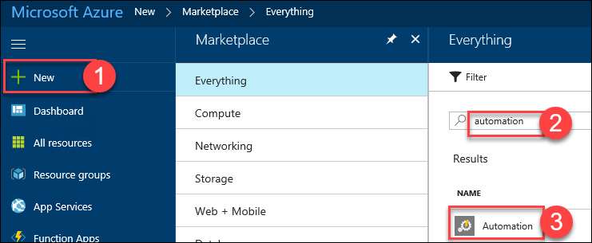

3.  Click **Create** on the Automation blade. This will display the **Add Automation Account** blade.

4.  On the **Add Automation Account** blade, specify the following information:

    a.  Name: **Automation-Acct**

    b.  Resource group: **HOLRGAUTO** (create a new resource group)

    c.  Location: **Choose the closest Azure region to you**

Note: Some features are only supported in East US 2 so please create your Automation Account in that region.

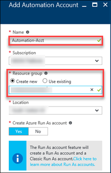

5.  Click the **Pin to Dashboard,** then click **Create**.

> 

### Task 2: Add an Azure Automation credential

1.  The CloudShopSQL DSC configuration requires a credential object to access the local administrator account on the virtual machine. Within the Azure Automation DSC configuration click **Credentials** in the **SHARED RESOURCES** section.

    

2.  Click the **Add a credential** button.

    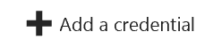

3.  Specify the following properties and click **Create** to continue.

    a.  Name: **SQLLocalAdmin**

    b.  User Name: **demouser**

    c.  Password & Confirm: **demo\@pass123**

        

Important: It is important to use the exact name for the credential, because one of the scripts you upload in the next step references the name directly.

### Task 3: Upload DSC configurations into automation account

1.  Click **Resource groups \> HOLRG \> Automation-Acct** and click **DSC Configurations**.

> 

2.  Click on the **+ Add a configuration** button.

> 

3.  On the **Import** pane, upload both **C:\\HOL\\CloudShopSQL.ps1** and **C:\\HOL\\CloudShopWeb.ps1** files. You'll need to click on **+ Add a configuration** a second time to upload the second file.

    

4.  After importing the .ps1 files, click the **CloudShopSQL** DSC Configuration. Then, select **Compile** on the toolbar (*click **Yes** on the overwrite prompt*). Do the same for **CloudShopWeb.**

> 

5.  Make sure to review the DSC configurations to ensure they have completed the compile prior to moving on to the next step.

    

### Summary

In this exercise, you configured an Automation account, and configured DSC configuration scripts that will be leveraged by the virtual machine resources.

## Exercise 2: Build CloudShop environment

Duration: 60 minutes

### Overview

In this exercise, you will run a template deployment using an ARM template provided which will deploy a Virtual Network, Azure Load balancer, two IIS Servers and a SQL Server. The Servers will check into Azure Automation and run the DSC Configurations that you built in Exercise 1. This will configure the boxes with the CloudShop Application. You will also configure Inbound NAT Rules to allow RDP access to the Web Servers. Azure diagnostics will also be configured into a new storage account for the VMs.

### Task 1: Template deployment

1.  In the portal, open your Azure Automation Account created earlier.

2.  Under **Account Settings,** locate the and click **Keys.**

    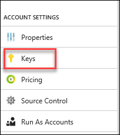

3.  Open ***Notepad*** and copy both the **Primary Access Key** and the **URL**. These will be needed inputs for the template deployment.

    

    

4.  In the Azure Portal, click the **+Create a resource** button. In the Search box, type **Template Deployment.**

5.  Select **Template Deployment and** click **Create** on the following screen.

    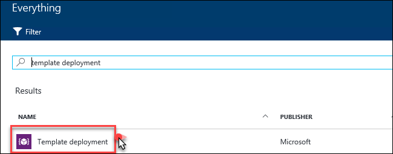

6.  On the **Custom deployment** screen, select **Build your own template in the editor**

> .

7.  Click **Load File.**

    

8.  In the Choose File to Upload dialog, navigate to the **C:\\HOL** folder, and locate the **OMSHacakthon-azuredeploy.json** file.

> 

9.  The JSON file will now be in the text window and the Parameters, Variables, and Resources should load in the Window. Click **Save**.

    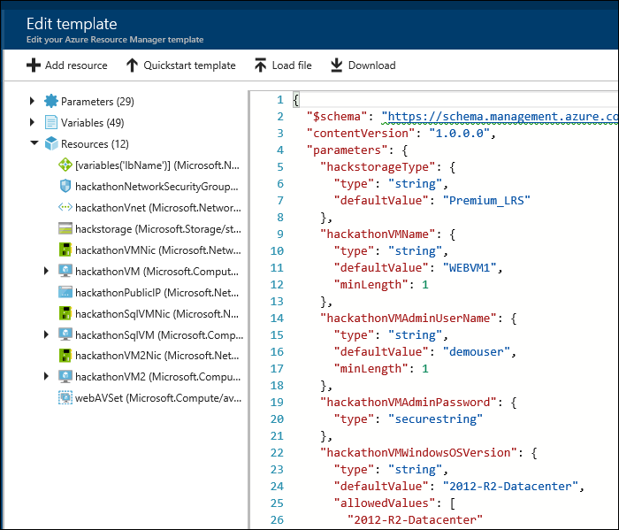

10. Once saved, the window will change to a screen which is asking for inputs. Use the following information to complete.

NOTE: In your student files C:\\HOL\\parameters.txt there is a parameters file that you can use to quickly copy and paste into the portal.

a.  Subscription: **Use the current subscription**

b.  Resource Group: **HOLRG** (create a new resource group)

c.  Location: **Choose the closest Azure region to you**

d.  HOL Storage Type: **Premium\_LRS**

e.  HOL VM Name: **WEBVM1**

f.  HOL VM Admin User Name: **demouser**

g.  HOL VM Admin Password: **demo\@pass123**

h.  HOL VM Windows OS Version: **2016-Datacenter**

i.  HOL Public IP DNS Name: **hol-then-five-random-lowercase-characters**

j.  Registration Key: Locate in the Automation Account Blade/Keys

k.  Registration URL: Locate in the Automation Account Blade/Keys

l.  Webnode Configuration Name: **CloudShopWeb.WebServer**

m.  Sqlnode Configuration Name: **CloudShopSQL.SQLSERVER**

n.  Reboot Node If Needed: **true**

o.  Allow Module Overwrite: **true**

p.  Configuration Mode: **ApplyAndMonitor**

q.  Configuration Mode Frequency Mins: **15**

r.  Refresh Frequency: **30**

s.  Action After Reboot: **ContinueConfiguration**

t.  HOL SQL VM Name: **SQLVM**

u.  HOL SQL VM Admin Name: **demouser**

v.  HOL SQL VM Admin Password: **demo\@pass123**

w.  HOL Sql VMSKU: **SQLDEV**

x.  VM Size SQL: **Standard\_DS2\_v2**

y.  HOL VM2Name: **WEBVM2**

z.  HOL VM2 Admin Name: **demouser**

a.  HOL VM2 Admin Password: **demo\@pass123**

b.  HOL VM2 Windows OS Version: **2016-Datacenter**

c.  Web AV Set Name: **webAVSet**

<!-- -->

11. Once completed, click the **I agree to the terms and conditions stated above,** and the **Pin to Dashboard** followed by **Purchase.**\
    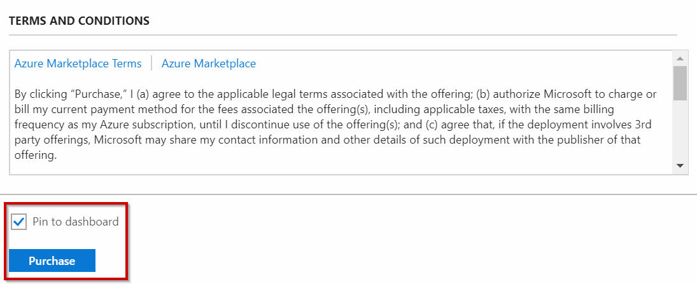

12. A Deployment tile will appear on your **My Dashboard**. This deployment should take about 25-30 minutes. The servers will take some time to check in with Azure Automation and configure the CloudShop application.

> 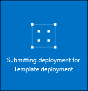

NOTE: Wait for the Deployment to successfully complete prior to moving on to the next steps.

13. Now that the servers are built, and the deployment is complete, let's verify the servers are up and running properly.

14. In the Azure Portal, open the **HOLRG,** and locate the Public IP Address **hackathonPublicIP**. Click on the blade to open.

> 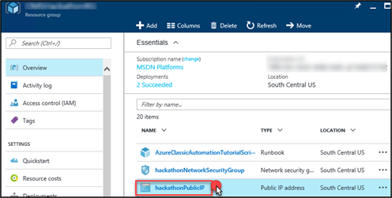

15. On the **hackathonPublicIP** blade, locate the DNS Name you provided during the template deployment. If you hover your mouse over the name, you can **click to copy** the name to the clipboard. Paste this into your Notepad document you opened earlier.

    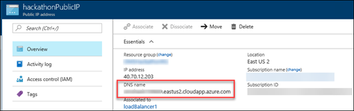

16. Open a new tab in Internet Explorer and paste the URL. This is the DNS name that is attached to the Azure Load Balancer in front of the CloudShop Application web servers **WEBVM1** & **WEBVM2**.

17. When the page loads, the CloudShop application should appear, and it will show which VM is serving the web page. In this screen capture, we see it is running on **WEBVM2**.

    

18. By pressing **F5** on your keyboard, you can refresh the website until you see that **WEBVM1** is also serving webpages.

    

### Task 2: Allow remote desktop to the WEBVM1 & WEBVM2 using NAT rules

Now that the deployment and the application is up and running, the next step is to allow RDP to the Web Servers. This will be accomplished by building NAT Rules through the Azure Load Balancer.

1.  Open the **HOLRG** Resource Group and locate **loadBalancer1**. Click to open its administration blade.

    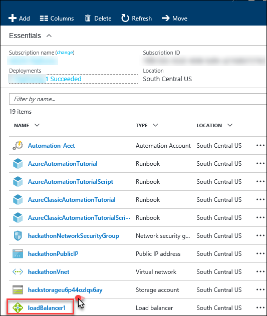

2.  On the **loadBalancer1** blade, locate **Inbound NAT rules,** and click in **Settings**.

    

3.  Click **+Add,** and complete the blade using the following information:

    i.  Name: **rdp-webvm1**

    <!-- -->

    a.  Frontend IP Address: **accept default**

    b.  Service: **RDP**

    c.  Port: **3389**

    d.  Associated to: **webavset**

    e.  Target: **Choose a virtual machine: WEBVM1**

    f.  Network IP configuration: **ipconfig1 (10.0.0.4)**

    g.  Port mapping: **Default**

        

4.  The portal will give a notice that it is: **"Saving load balancer inbound NAT rule**". Wait until this completes before continuing.

    

    

5.  Click **+Add,** and complete the blade using the following information:

    h.  Name: **rdp-webvm2**

    i.  Frontend IP Address: **accept default**

    j.  Service: **RDP**

    k.  Port: **3390**

    l.  Target **Choose a virtual machine: WEBVM2**

    m.  Network IP configuration: **ipconfig1 (10.0.0.5)**

    n.  Port mapping: **Custom**

    o.  Floating IP: **Disabled**

    p.  Target Port: **3389**

        

6.  The portal will give a notice that it is: **"Saving load balancer inbound NAT rule**". Wait until this completes before continuing.

    

    

7.  To verify the new NAT Rules are working, move back to the **HOLRG** in the Azure portal. Click **WEBVM1,** and the **Connect** Link should now be available. Click **Connect,** and the portal will download an RDP file. Open this and connect to the VM.

    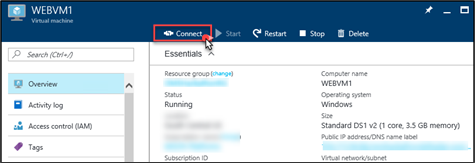

8.  Click **Open** when the RDP file downloads.

    

9.  You will get a warning about the publisher of the RDP file being unknown. Click **Don't ask me again for connections to this computer** and click **Connect.**

    

10. When prompted by Windows Security, enter your credentials.

    q.  User Name: **demouser**

    r.  Password: **demo\@pass123**

        

11. A warning will appear stating: **The identity of the remote computer cannot be verified. Do you want to connect anyway?** Click the checkbox for the disclaimer: **Don't ask me again for connection to this computer.** Then, click **Yes**.

    

NOTE: When connecting to machines during this lab for the first time, you may encounter the same warnings etc. Follow these same steps to no longer receive those warnings as they do not apply to our setup.

12. When logging on for the first time, you will see a prompt on the right asking about network discovery. Click **No**.

13. Notice the Server Manager opens by default. On the left, click **Local Server**.

14. On the right side of the pane, click **On** by **IE Enhanced Security Configuration**.

15. Change to **Off** for Administrators and click **OK**.

16. In the lower left corner, click on the **Windows** button to open the **Start Screen**. Then, click **Internet Explorer** to open it. On first use, you will be prompted about security settings. Accept the defaults by clicking **OK**.

17. Leave your RDP Session to **WEBVM1** open and minimized. Then, repeat this same procedure for **WEBVM2**.

### Task 3: Configure diagnostics accounts for the VMs

In this task, you will configure the VMs to capture diagnostic data in an Azure Storage Account. Later you will connect this account to the Azure Security Center and Log Analytics.

1.  In the Azure Portal navigate to the **HOLRG** Resource Group and locate **WEBVM1**. Click the name to open the blade.

2.  On the **WEBVM1,** locate the **Monitoring** section, and click on **Diagnostic Settings**.

> 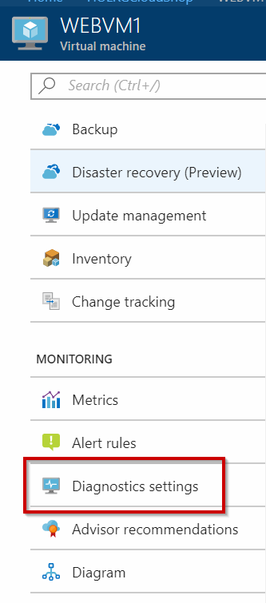

3.  Click the **Enable guest-level monitoring** button. This will load more information to choose from. Click the Storage Account Configure Required Settings, and then, choose the Storage Account you just created.

    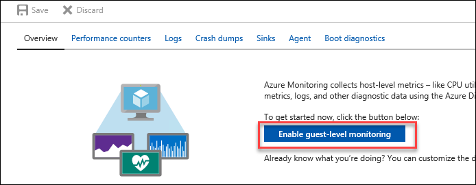

    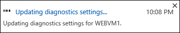

4.  Select the Configure performance counters.

    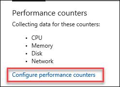

5.  Next check the **ASP.NET box,** and click **Save**.

    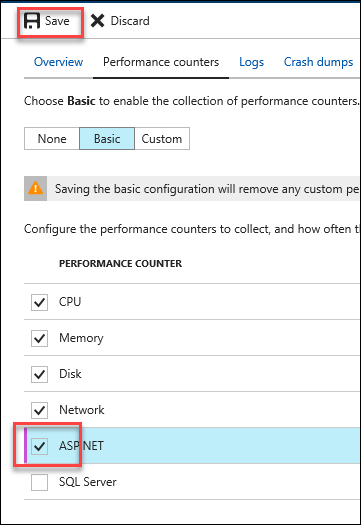

6.  This will submit a deployment for **WEBVM1**.

    

NOTE: You will need to wait for the portal to complete the update before moving to the next step.

7.  Complete the same steps for **WEBVM2**.

NOTE: You will need to wait for the portal to complete the update before moving to the next step.

8.  Next, using the same steps, configure **SQLVM** for Diagnostics as well, Select the following metrics for this SQL Server, and click **Save**.

    a.  SQL Metrics

> 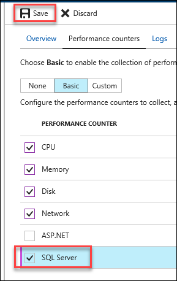

### Summary

In this exercise, you ran a template deployment using an ARM template provided which created a Virtual Network, Azure Load balancer, two IIS Servers and a SQL Server. The servers checked into Azure Automation and ran the DSC Configurations that configured the boxes with the CloudShop Application. You then configured Inbound NAT Rules to allow RDP access to the Web Servers and successfully connected. Azure diagnostics was also configured into a new storage account for the VMs.

## Exercise 3: Build and configure Azure Security Center and Azure Management

Duration: 30 minutes

### Overview

The next step is to provision the Azure security and Azure management components of Azure Automation, configure the VMs for the CloudShop application to be managed by the portal, and configure the diagnostics storage account to load data into the Log Analytics platform. Additionally, you will configure Update Management, Inventory Tracking and Change Management as well as install and configure the Service Map solution pack.

### Task 1: Provision Log Analytics through Azure Monitor

1.  Open the **Azure portal** and navigate to Azure Monitor by clicking **All services**, searching for "*monitor*", and selecting **Monitor**.

> 

2.  In the **Overview** blade, click the **Add** button below **Log Analytics**.

> 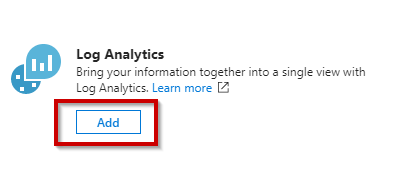

3.  Complete the OMS Workspace blade using the following information. Then, click **Pin to Dashboard** and click **OK**:

    a.  OMS Workspace: **Unique name**

    b.  Subscription: **Select the current subscription**

    c.  Resource Group: **HOLRG**

    d.  Location: **Closest to your deployment**

    e.  Pricing Tier: **Select Per Node (OMS)\
        **

        

4.  The deployment will only take a few moments to complete. Upon completion, open **Log Analytics** by clicking on the Log Analytics resource within the **HOLRG** resource group

    

5.  Once it loads in the Azure Portal, move the slider bar down, and click **Virtual Machines** which is found in the **Workspace Data Sources** section.

    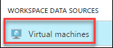

6.  A list of the VMs in your subscription will be shown in the list. You may want to filter your view to see the VMs for this HOL. You will add the WEB and SQL VMs.

    

7.  Click the **SQLVM** to load a blade to the right. Then, click **Connect** to add it to this Log Analytics Workspace.

    

8.  Follow the same steps for the **WEBVM1** & **WEBVM2**.

9.  The portal should update to show that they are now a part of "This workspace" once they have all been added.

    

### Task 2: Explore Security Center

1.  Open the Azure portal and navigate to the **Security Center** menu option (**All Services Security Center**).

    

2.  This will present the **Security Center - Overview** screen. Notice that it's already collecting data. For this exercise, you want to upgrade to Standard tier which extends the capabilities of the Free tier to workloads running in private and other public clouds. It provides unified security management and thread protection across your hybrid cloud workloads. The Standard tier also adds advanced thread detection capabilities, which uses built-in behavioral analytics and machine learning to identify attacks and zero-day exploits, access and application controls to reduce exposure to network attacks and malware, and more.

    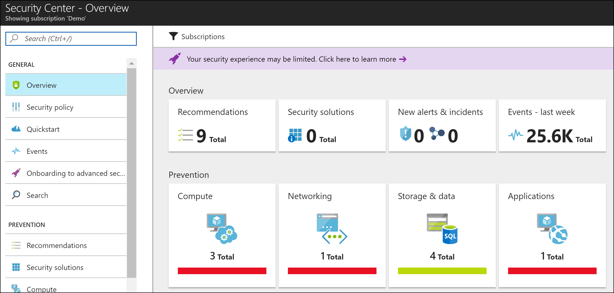

3.  Click **Onboard to Advanced Security**.

4.  Select the subscription you would like to upgrade by clicking on the subscription name.

> 

5.  Select the **Standard** pricing tier and click **Save**.\
    \
    

6.  Close the panel and navigate back to the **Security Center Overview** screen. Click on **Security policy** under the **General** section. This is where you will enable data collection.

    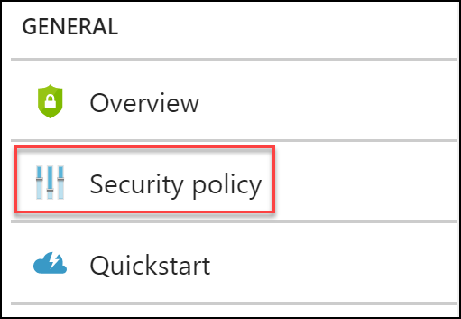

7.  This brings up the **Security policy** screen where you will click on your subscription name which is currently in an Off state for data collection.

    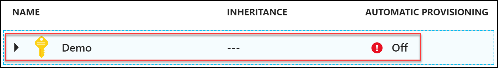

8.  This presents the **Data Collection** screen. Turn on data collection by clicking the **On** button, selecting **Use another workspace** and selecting the Log Analytics workspace created in [Task 1: Provision Log Analytics](#task-1-provision-log-analytics-through-azure-monitor) and then clicking **Save** and click on Yes if prompted.

    

### Task 3: Add Service Map

In this section, you will add Service Map to Log Analytics.

1.  From the Azure portal, click the **+Create a resource** Link followed by **Monitoring + Management** and **See all**.\
    \
    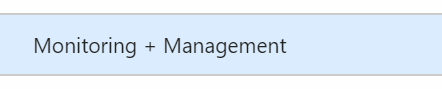

2.  Note there are many solutions available, and more are added frequently. Browse the solutions to gain familiarity with the options.

    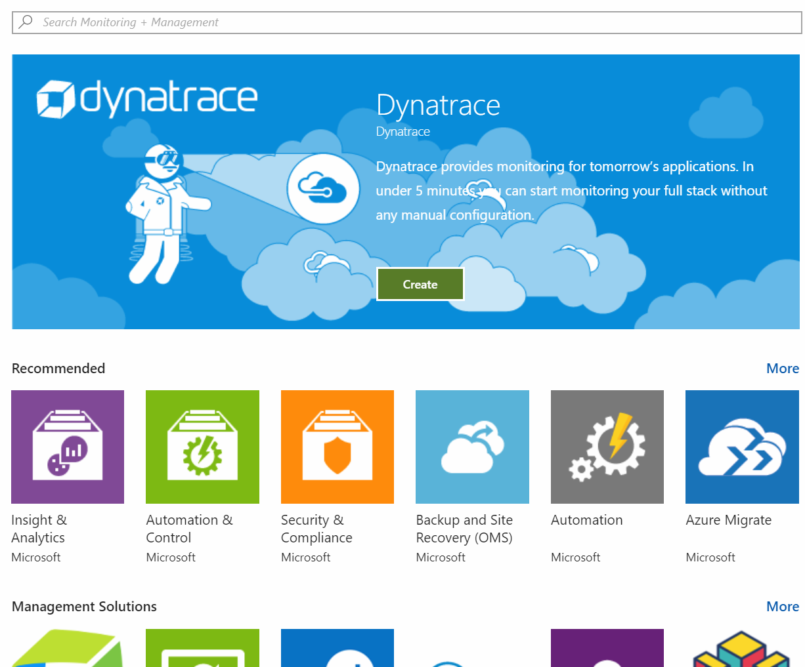

3.  Locate the **Service Map** solution and select it. If you don't see it on the page, use the *Search Monitoring + Management* field at the top of the screen to search for **Service Map**. On the Details page, you can read about the solution. When ready, click **Create.**

    

4.  Select the OMS Workspace you created and check the **Pin to dashboard** before selecting **Create.**

    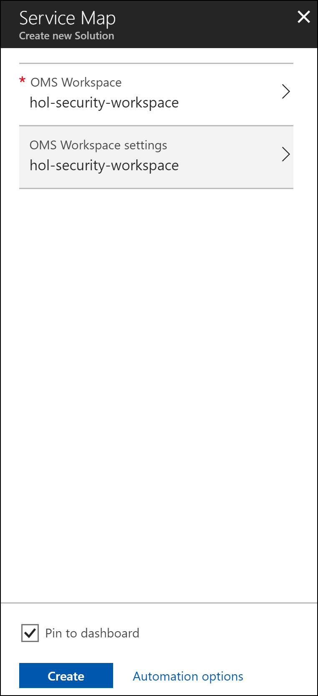

### Task 4: Configure Service Map

To configure the Service Map functionality, the Microsoft Dependency Agent needs to be installed on each virtual machine.

1.  Open a Remote Desktop Connection to **WEBVM1**. Use the same credentials we configured during the earlier exercise.

2.  Open the web browser to download and run the installer from <https://aka.ms/dependencyagentwindows>

3.  The installer will start. Click **I Agree.**

    

4.  The installer will take a few moments and once it has completed, click on the **Finish** button.

    

5.  Repeat the same steps above for **WEBVM2**.

6.  Disconnect from any remote desktop connections.

7.  In the Azure Portal, navigate to the **All Resources** menu and locate the **Service Map** resource you created earlier. Click on the resource name.

    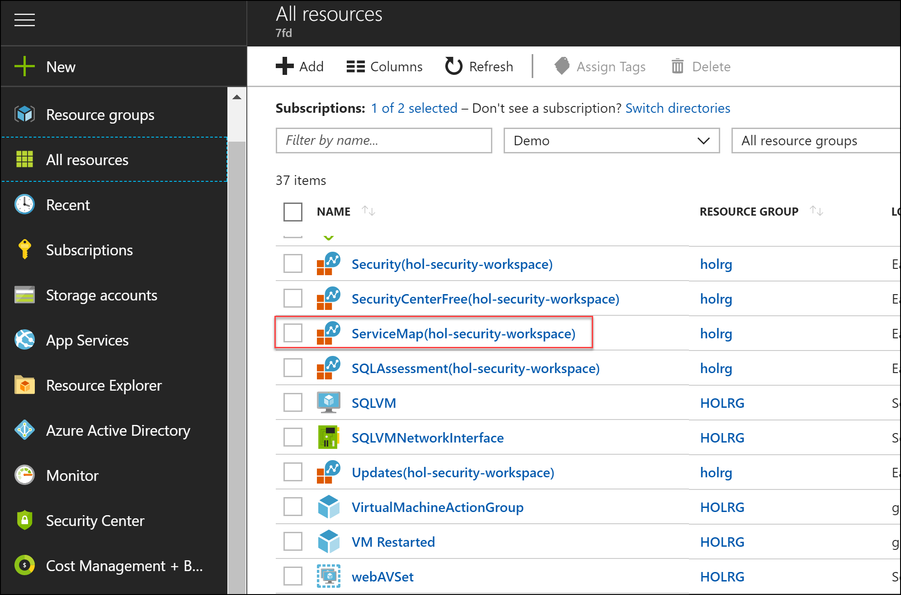

8.  This will bring up the Service Map screen and you'll see that it's already populated with some data. Since we installed the agent on the two Windows virtual machines, the Service Map is showing both virtual machines now reporting data. Click on the **Service Map** tile.

    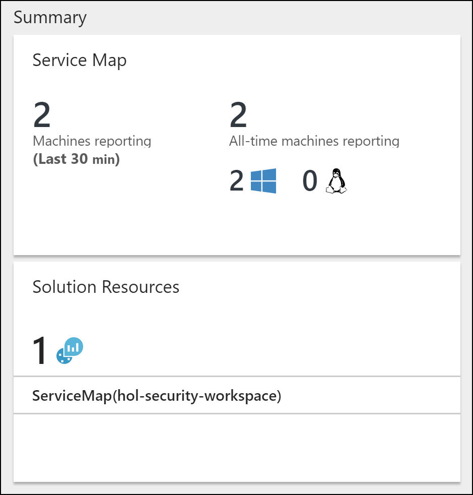

9.  When the Service Map loads, click on **WEBVM1** to see the data that has been analyzed for that virtual machine.

    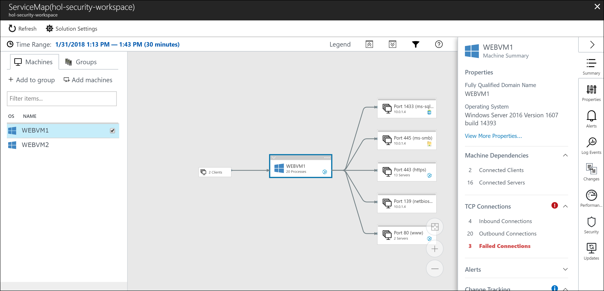

### Task 5: Configure Update Management

The Update Management functionality will be configured through your Virtual Machines.

1.  In the **Azure Portal**, browse to **WEBVM1**.

2.  Select **Update management** under **OPERATIONS**.

> 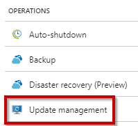

3.  Select your **Log Analytics workspace** and **Automation Account** and click **Enable**.

> 

4.  Wait for the deployment to complete. This can take up to 15 minutes.

> 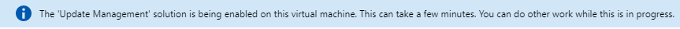

Do not navigate away from the Update Management blade until the deployment message reads "The 'Update Management' solution is being deployed on this virtual machine. This can take a few minutes. You can do other work while this is in progress."

5.  While the solution is deploying, navigate to **WEBVM2** and repeat steps 2-4.

6.  While the solution is deploying, navigate to **SQLVM** and repeat steps 2-4.

7.  Verify that the solution has been deployed by navigating to **WEBVM1** and clicking on **Update management** under **OPERATIONS**.\
    \
    \
    

### Task 6: Configure Inventory Tracking and Change Management

The Update Management functionality will be configured through Azure Automation.

1.  In the **Azure Portal**, browse to **WEBVM1**.

2.  Select **Change tracking** under **OPERATIONS**.\
    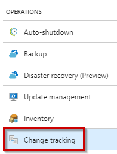

3.  Verify the **Log Analytics workspace** and **Automation Account** and click **Enable**.

> 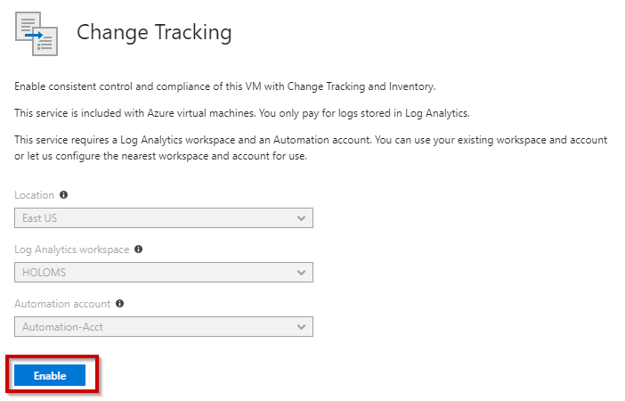

4.  Wait for the deployment to complete. This can take a few minutes.

> 

Do not navigate away from the Update Management blade until the deployment message reads "The 'Change Tracking and Inventory' solution is being deployed on this virtual machine. This can take a few minutes. You can do other work while this is in progress."

5.  While the solution is deploying, navigate to **WEBVM2** and repeat steps 2-4.

6.  While the solution is deploying, navigate to **SQLVM** and repeat steps 2-4.

7.  Verify that the solution has been deployed by navigating to **WEBVM1** and clicking on **Change tracking** under OPERATIONS.\
    \
    \
    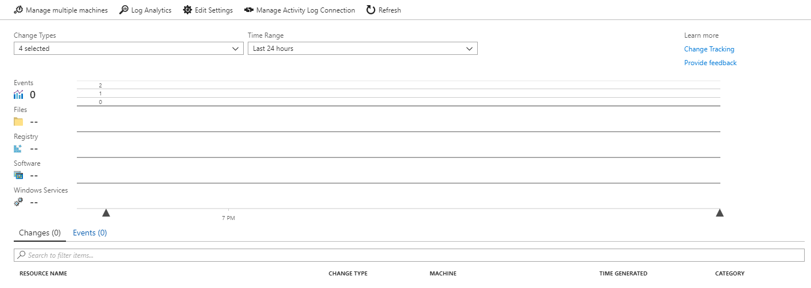

### Summary

In this exercise, you provisioned the portal, configured the VMs for the CloudShop application to be managed by the Portal, and configured the diagnostics storage account to load data into the Log Analytics platform. Additionally, solution packs were installed and configured to gather data and provide dashboards for applications deployed in Azure IaaS. You also configured Service Map and now understand how it surfaces data.

## Exercise 4: Instrument CloudShop using Azure Application Insights

Duration: 45 minutes

### Overview

In this exercise, you will instrument the CloudShop using Application Insights at runtime. This will be accomplished by installing the Applications Insights tool on the web services and configuring an Application Insight workspace in Azure. Then, you will configure Application Insights to perform web tests and alerts. The final task will be to connect the Application Insights workspace to send data to the Portal.

### Task 1: Install and Configure the Application Insights Status Monitor

To read more about this tool follow this link: <http://bit.ly/2ksdzKV>

1.  Open a Remote Desktop Connection to **WEBVM1**.

2.  Open Internet Explorer and follow this link: <http://bit.ly/2jxQ43z>. Click **Run** on the Question if you want to run the file: **AppliationsInsightsMonitor.exe**.

    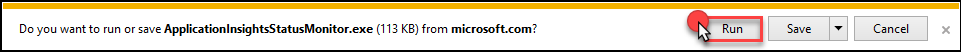

3.  This will start the Web Platform Installer. Click **Install** followed by **I Accept** on the following screen, and **Continue**.

    

4.  Once the Monitor is installed, click the **Sign In** link under the **Configuration**.

    

5.  You will sign-in to Azure as normal.

    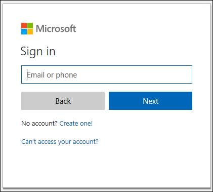

6.  Under the **Send telemetry to**: Select **New Application Insights resource**. Then, click **Configure settings**.

    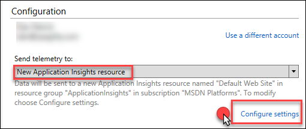

7.  On the **Configuration settings for Application Insights**, complete the information as follows, and click **OK**.

    a.  Microsoft Azure Subscriptions: **Use the same subscription**

    b.  Resource Groups: **HOLInsights**

    c.  Application Insights Resource: **HOLCloudShop**

    d.  Location: **Select the same region as your deployment**

        

8.  This will build the Application Insights workspace for you in Azure.

9.  Next, click **Add** **Application Insights**.

    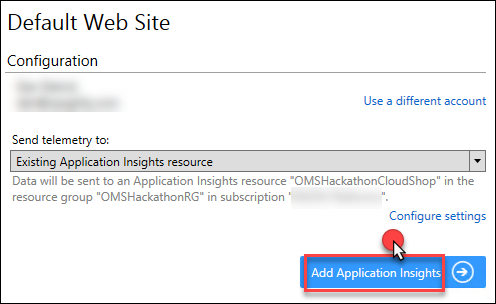

10. Click **Restart IIS** to complete the Setup.

    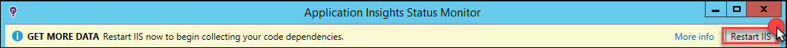

11. This will only take a few seconds. Now, the CloudShop application running on **WEBVM1** is instrumented and sending data to **Azure Application Insights**. The monitor on **WEBVM1** should now look like below:

    

12. Disconnect from **WEBVM1**.

13. Connect to a Remote Desktop Session for **WEBVM2**.

14. Open Internet Explorer and follow this link: <http://bit.ly/2jxQ43z>. Click **Run** on the Question if you want to run the file: **AppliationsInsightsMonitor.exe**.

    

15. This will start the Web Platform Installer. Click **Install** followed by **I Accept** on the following screen, and **Continue**.

    

16. Once the Monitor is installed, click the **Sign In** link under the **Configuration**.

    

17. You will sign-in to Azure as normal.

> 

18. Under the **Send telemetry to**: Select **Existing Application Insights resource**. Then, click **Configure Settings**.

    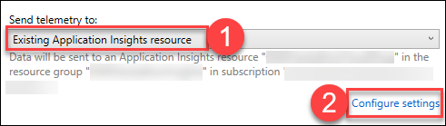

19. On the **Configuration settings for Application Insights**, complete the information as follows, and click **OK**.

    e.  Microsoft Azure Subscriptions: **Use the same subscription**

    f.  Resource Groups: **HOLInsights**

    g.  Application Insights Resource: **HOLCloudShop**

    h.  Location: **Select the same region as your deployment**

        

20. This will attach **WEBVM2** to the Application Insights workspace you created a moment ago in Azure. Next, click **Add** **Application Insights**.

    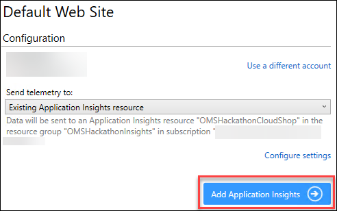

21. Click **Restart IIS** to complete the Setup.

    

22. This will only take a few seconds. Now, the Cl\`

<!-- -->

1.  

2.  Click the ellipse on each '...' tile, and click through each option to see the different data being pulled as a part of the Application Insights data.

    a.  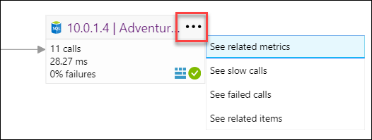

        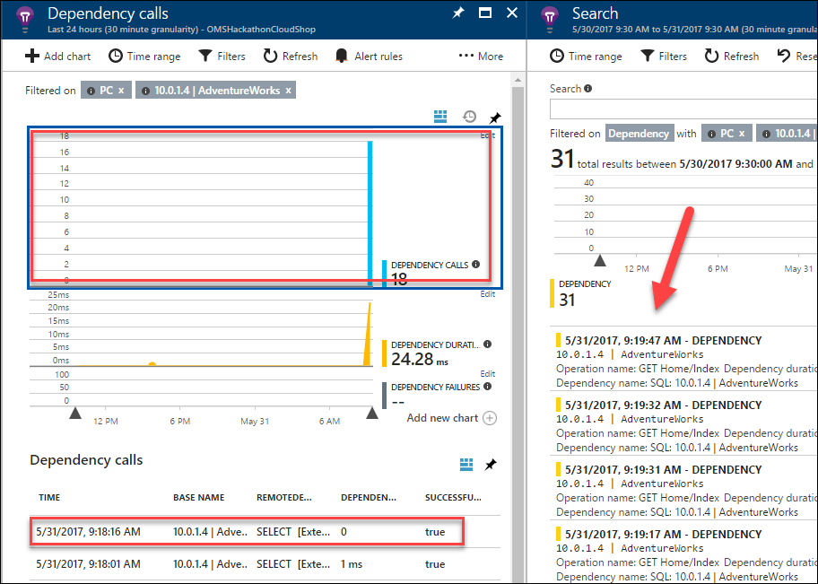

        

3.  Close the **App Map** pane, then Click on the **Alerts** in the **Configure** section.

    

4.  Click **+Add Metric Alert,** complete the blade with the following information, and click **OK**.

    b.  Name: **CloudShopProcessorAlert**

    c.  Metric: **Processor Time**

    d.  Condition: **Greater than**

    e.  Threshold: **80**

    f.  Period: **Over the last 5 minutes**

    g.  Notify via: Email owners, contributors and readers -- **Check the Box**

        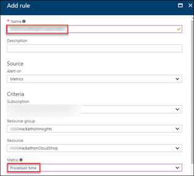

        

5.  The portal will update with the new Alert.

    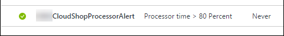

6.  In your **HOLRG,** locate the **hackathonPublicIP** Public IP Address, and take note of the DNS name which is on the front of the Azure Load Balancer for the CloudShop App running on **WEBVM1** & **WEBVM2**.

7.  Next in the **HOLCloudShop** Application Insights workspace, under the **Investigate** section, and click **Availability**.

    

8.  Click **+Add test**, and complete the blade using the following information. Then, click **Create**.

    h.  Test name: **CloudShopWebTest**

    i.  Test type: **URL Ping Test**

    j.  URL: **http://HOLXXXXXX.southcentralus.cloudapp.azure.com**

    k.  Test locations: Choose locations from all over the world

    l.  All other accept defaults

> 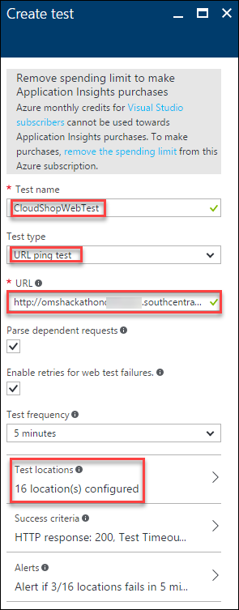

Note: If the CloudShop Application becomes unavailable to this WebTest, you will then receive an email alert from Azure Application Insights.

9.  Click **Performance Testing** in the **Configure** section.

    

10. Click **+New**.

11. Click **Configure Test Using** and complete this using these inputs. Then, click **Done**.

    m.  Test Type: Manual Test

    n.  URL: **http://HOLXXXXXX.southcentralus.cloudapp.azure.com**

> 

12. Complete the **New Performance Test** blade using the following information, and click **Run Test**.

    o.  Name: **CloudShopLoadTest**

    p.  Generate Load from: **Select a Region**

    q.  User Load: **2000**

    r.  Duration: **5**

        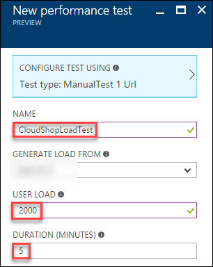

NOTE: An error may occur if you do not have a Visual Studio Team Services (VSTS) Account configured. If so, then you'll need to create one before setting up the Performance Test.

13. Once this is submitted it will show as **Queued.** Click the line and then details about the performance test will be shown.

    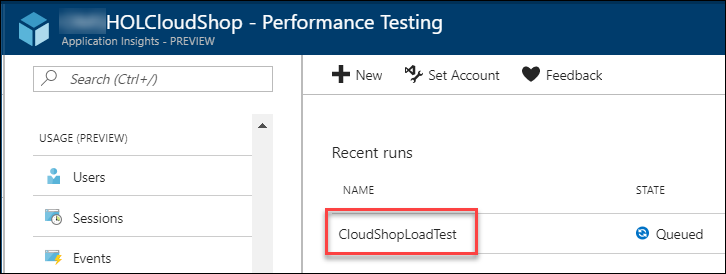

> Click the Messages box to see the details of the test.

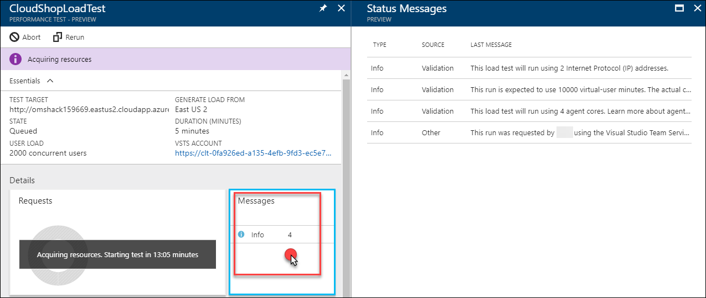

14. Now, head back to the Overview blade of the **HOLCloudShop** Application Insights and click **Live Stream**.

    

15. Real-time application information can be seen regarding the CloudShop App running in Azure on our IaaS VMs. Here, you can wait for the Performance Test to run, and show how the Web Application performs.

    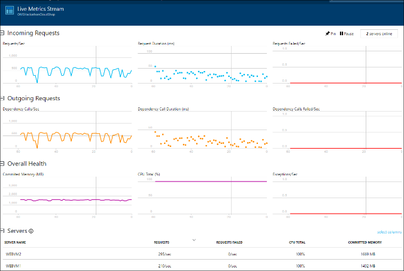

16. If you go back to the **Performance Testing** blade, and click on **CloudShopLoadTest,** you will see the metrics form the run.

    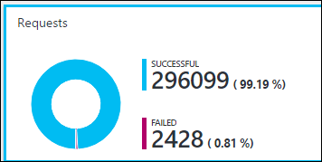

17. Close the Performance Test, and click on the **Performance** under Investigate.

    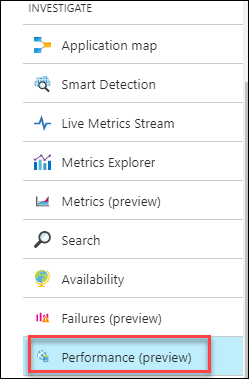

18. Explore the metrics from the CloudShop Application.

    

19. The Load Test should also have caused the Alert configured to be trigged. An email should have been received.

    

20. The alert will quickly resolve as the Load Test has completed causing the CPU condition to quiet.

    

### Task 3: Simulate a failure of the CloudShop application

1.  Move to your **HOLRG** Resource group and stop both **WEBVM1** and **WEBVM2**.

2.  Navigate back to the **HOLCloudShop** Application Insights portal. Once the website goes down, notice there are now Alerts.

    

3.  Hover over the tile **Pin** **the** **Alerts** to **My Dashboard**. Click the **Alert Tile**, and this will load the Alert Rules Blade. The first alert will be an alert based on the WebTest. The second will be a Failure Anomalies Alert.

    

4.  Click the **CLOUDSHOPWEBTEST** alert which will show you more details about the error condition.

    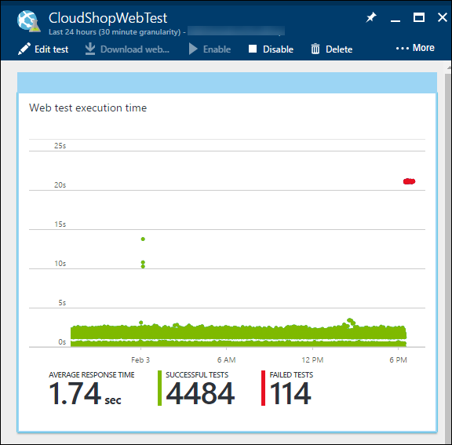

5.  A few email alerts should come into your inbox.

    

    

6.  Click the "See the analysis of this issue" which will load the Azure portal.

    

7.  Move back to your **HOLRG and** restart the VMs.

8.  Once the VMs are back online, the website will come back up. This will initiate responses to the Web Test and sending data to the Applications Insights portal. An email will be sent resolving the Alert. After a period of time, the Smart Detection Alert will also resolve.

    

### Summary

In this exercise, you instrumented the CloudShop using Application Insights at runtime. This was accomplished by installing the Applications Insights Monitor for the web services and configuring an Application Insight workspace in Azure. Then, you configured Application Insights to perform web tests and alerts.

## Exercise 5: Explore Azure Security and Operations Management, Application Insights and build a dashboard

Duration: 45 minutes

### Overview

In this exercise, you will explore the information and data being provided by Azure Security and Operations Management and Application Insights to gain situational awareness of the application and infrastructure. You will look at the Security posture of the infrastructure, the applications performance, and build a dashboard that can be used to manage it moving forward.

### Task 1: Work with Log Analytics data and Azure Monitor

In this section, we will perform an ad-hoc search in Log Analytics data to see where our servers are not in compliance with security baselines. In the Log Search interface, we can perform ad-hoc searches against the log data being ingested into the Log Analytics service. Because the data is indexed, searching is very fast.

1.  Open the **Azure portal** and navigate to Azure Monitor by clicking **All services**, searching for "*monitor*", and selecting **Monitor**.

> 

2.  Select **Log Analytics** under **SHARED SERVICES** to navigate to your workspace.

> 

3.  In the search field, enter the following query: *Update \| where OSType!=\"Linux\" and Optional==false*. Click Run. This will search the Update management logs and report results. There are many other data sources we can query.

> 

Note: you may have less or more data, but keep in mind, the service has only been collecting data since you began the lab.

4.  Notice in the left, there are different types of data. Click **Windows Defender** followed by **Apply**.

    

5.  Notice the query dialog (where you entered a search before) has a search string in it querying for the type "Product==Windows Defender".

    

6.  As you click on options in Log Search, queries are built automatically. Also, notice the results are paired down to a smaller subset of data. Click on **Table** to view the data in a column and row format.

> 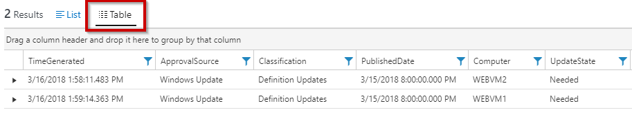

7.  This is a list of Windows virtual machines tracked in Update management that have pending updates for Windows Defender. To further refine the list, scroll on the left down to **UPDATESTATE** and select **Needed**. Notice the query automatically updates as it is a single point to refine.

> 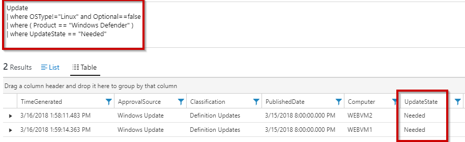

8.  Further refinements can be made as needed. Select additional refiners to update the search.

9.  Next, sort the findings, so the Computers are sorted alphabetically. Click on the column header **Computer** until the virtual machines are sorted correctly.

> 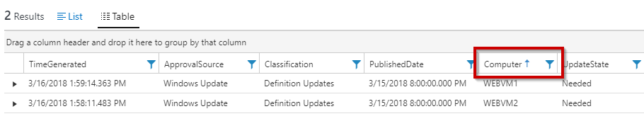

10. Now we will export the list. This may be helpful if we wanted to divide the findings list out amongst administrators, so several people can help remediate the findings. Click on **Export**.

    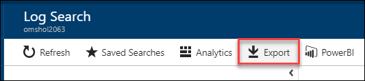

    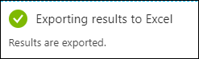

11. Once the report is exported, you are prompted what to do with the file. Click on **Save**. Once completed, click on **Open**. Choose **Notepad** to open the file**.**

> 

12. Review the text file. Then, close it. You can also copy the file to your local PC and view in Excel.

    

13. Because this is a useful query, we can save it to be able to quickly run it again anytime we wish. First, copy the search query to the clipboard.

    

14. Click the **Saved Searches** followed by **+Add.**

    

15. Complete the Add Saved Search Blade with this information:

    a.  Display Name: **Computers Needing Windows Defender Updates**

    b.  Category: **My Queries**

    c.  Query: paste the query from your clipboard

    d.  Function Alias: **WindowsDefNeeded**

        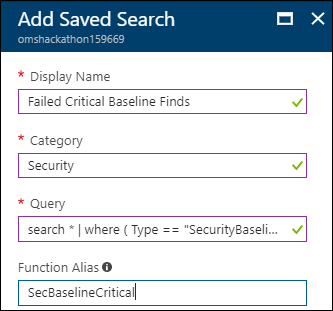

16. Click **OK.**

### Task 2: Prevention

In this section, we will use the Security Center Overview screen to review what preventative steps we can take to protect our environment.

1.  Within **Security Center** **Overview** page, there are four tiles in the middle of the screen under **Prevention**.

    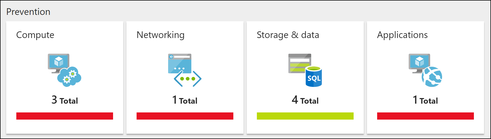

2.  Click on the **Compute** tile to drill into the security health of your compute resources.

    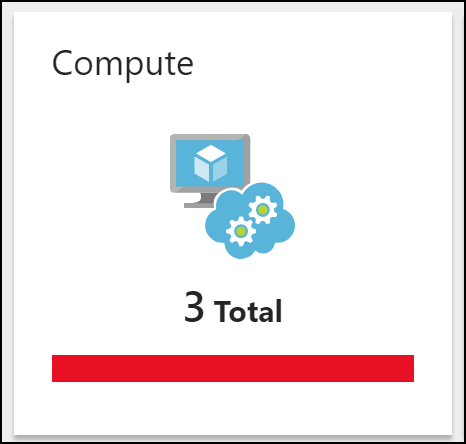

3.  Notice there are several recommendations at the bottom of the screen. Let's go ahead and drill into these recommendations. Click on the **Remediate security configuration** item.

    

4.  This brings up the **Remediate security configurations** panel where we can see there are many configuration items to address. Take some time to explore the items called out in this list. As you click on each item, you'll see more details that allow you better understand the recommendation, the vulnerability, and the potential impact.

    

    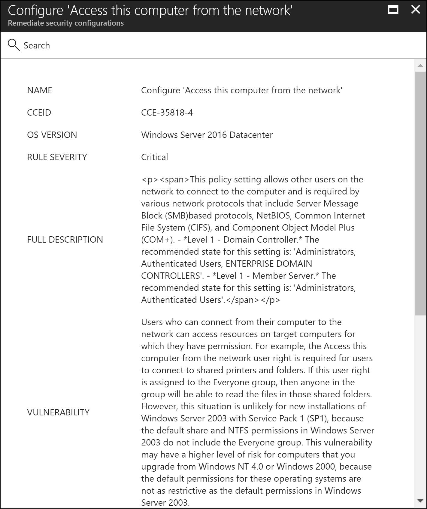

5.  Close the panel and navigate back to the **Security Center Overview** page. This time, click on the **Networking** tile to drill into the security health of your networking resources.

> 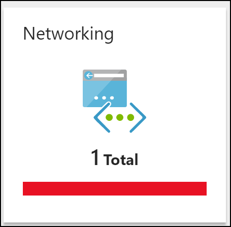

6.  Based on the details showing in the **Networking Recommendations**, it appears we don't have a Next Generation Firewall installed. We won't implement this recommendation today, but if we wanted to, we could click on the item and implement the recommendation from this panel.

    

7.  Close the panel and navigate back to the **Security Center Overview** screen. This time, click on the **Storage & data** tile.

    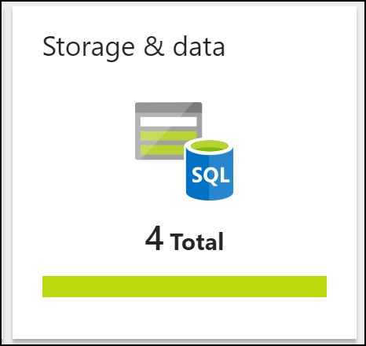

8.  Notice this tile is green which is an indication the resources are in a healthy state. Azure Security Center will flag the tile as red if there are critical recommendations that need to be addressed.

9.  As a last step, let's navigate back to the **Security Center Overview** screen and click on the **Applications** tile.

    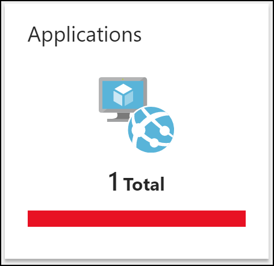

10. As you review the Applications Security Health, notice there's a recommendation to implement a Web application firewall.

    

11. Go ahead and close this panel and return to the **Security Center Overview** page.

12. Azure Security Center provides a quick way to see all the recommendations we just saw in a single view. Click on the **Recommendations** tile under the Overview section.

    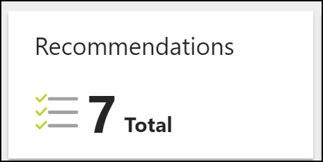

13. This presents the same recommendations you saw by navigating to each resource type in the previous steps. Clicking the ellipse by each of the recommendations will provide you with additional steps you can take to remediate the recommendation.

    

### Task 3: Set up a manual activity log alert

If one of the virtual machines in the resource group were to be restarted, that's a condition you would want to be notified of. In this section, we will set up a manual alert to detect this condition.

1.  Open the **Azure portal** and navigate to Azure Monitor by clicking **All services**, searching for "*monitor*", and selecting **Monitor**.

> 

2.  Select **Alerts** under **SHARED SERVICES**.

> 

3.  Then, click **Add activity log alert** and fill out the form to match the screen shot below for the **Source**, **Criteria**, and **Alert via** sections. We're creating the alert to notify us anytime a virtual machine in the **HOLRG** is restarted. Note that we are configuring it to notify us via the Azure mobile application which will configure shortly.

4.  In the Actions section, enter a unique name in the **Action Name** field and select the **Action Type** of **Email/SMS/Push/Voice**. The details blade will open automatically.

> 

5.  Selecting the **Email/SMS/Push/Voice** Action Type pops up a panel for entering the recipients email address. This is the same address you will use when you login to the Azure mobile application shortly. This is also the same address you are using to login to your Azure subscription. Click **OK**.

> 

6.  Confirmation messages will display once the action group and the alert rule have been created successfully by clicking **OK**.

> 

### Task 4: Installing & using the Azure mobile application

In this section, you will take your monitoring solution mobile by installing and configuring the OMS Mobile Application.

1.  Open the **AppStore** or **Google Play** on your mobile device. Locate the search box and type **Microsoft Azure,** and press enter.

2.  When you locate the Microsoft Azure application, install it to your device.

    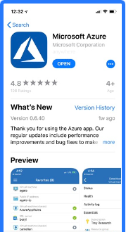

3.  Once the application has been installed, you will need to allow the application to send you notifications.

4.  Next, touch the Sign In Button.

    

5.  Once the login page loads, enter your Azure Credentials.

6.  Once you are logged into the app, navigate to the Notifications menu to see there are currently no notifications.

    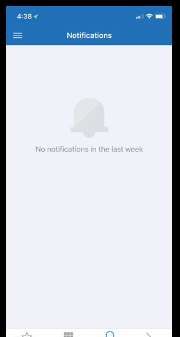

7.  Putting the phone aside for a moment, in your desktop web browser, navigate to the **HOLRG** resource group list in the Azure portal.

8.  Click on the WEBVM1 that you created earlier. We will restart this virtual machine, which should cause a trigger to the Azure mobile application.

> 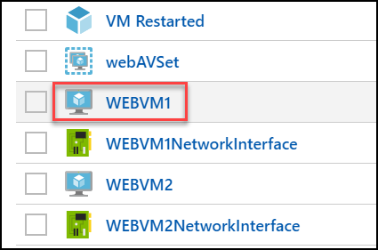

9.  Click the **Restart** button the toolbar to restart the virtual machine.

    

10. Click **Yes** to confirm that you want to restart this virtual machine.

11. In a few moments, you will receive an alert through the Azure mobile app that the virtual machine was restarted.

### Task 5: Application Insights

Understanding what is happening within an application can be very challenging, but with the Application Insights configured for CloudShop, there is great telemetry being fed to the Azure Portal. Here, you will investigate that data regarding how the CloudShop is performing.

1.  Open the **Azure portal** and navigate to Azure Monitor by clicking **All services**, searching for "*monitor*", and selecting **Monitor**.

> 

2.  Locate the **HOLCloudShop** Applications Insight resource in the **Overview** blade and click **HOLCloudShop.**

> 

1.  From the **Overview** blade, click **Pin to Dashboard**.

> 

2.  Under the **INVESTIGATE** section, click the **Performance (preview)** item**.**

    

3.  The **Performance** feature of Application Insights allows us to get rich performance monitoring and easy to consume dashboards.

    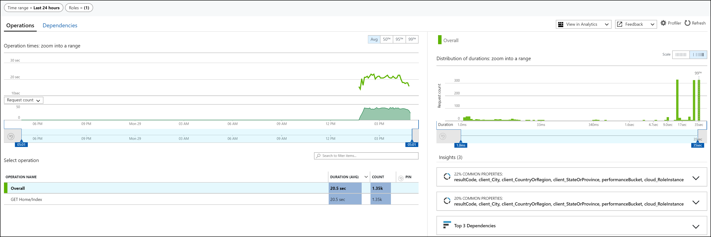

4.  This dashboard gives near real-time insight into what's happening with your application. In the screenshot below, you can see this application appears to have a performance issue with the Home/Index page. It appears to be taking 20.5 seconds on average to load. NOTE: Your numbers may not match. By clicking on the GET Home/Index, you will see the other sections of the dashboard will filter to performance data focused on that page.

    

5.  Feel free to experiment with this dashboard to understand the performance considerations of your application.

    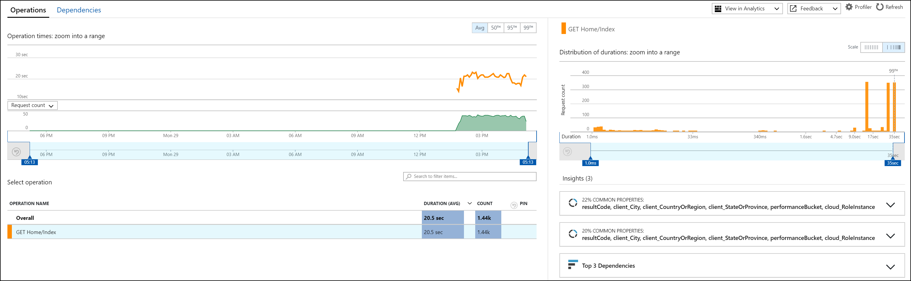

6.  Pin this dashboard to My Dashboard by clicking on the pin in the top right of the screen.

    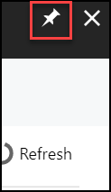

7.  At this point, navigate back to **My Dashboard** and click **Edit Dashboard,** and arrange the many tiles you have added to give yourself an all up view of the environment you have built. Feel free to open the various solutions, find interesting data and Pin it to the Dashboard.

    

### Summary

In this exercise, you explored the information and data being provided by Azure Security and Operations Management and Application Insights to gain situational awareness of the application and infrastructure. You looked at the Security Posture of the infrastructure, the performance of applications, and you built a dashboard that can be used to manage it moving forward.

## After the hands-on lab 

Duration: 10 mins

### Overview

In this exercise, attendees will de-provision any Azure resources that were created in support of the lab.

1.  Delete the **HOLRG, HOLInsights**, and **OPSLABRG** resource groups.

