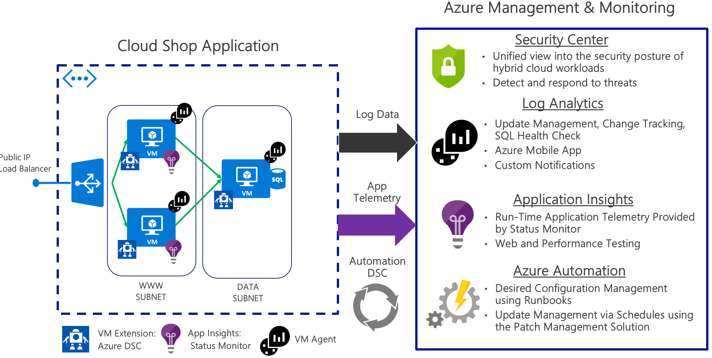
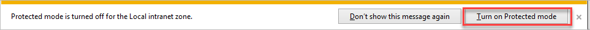
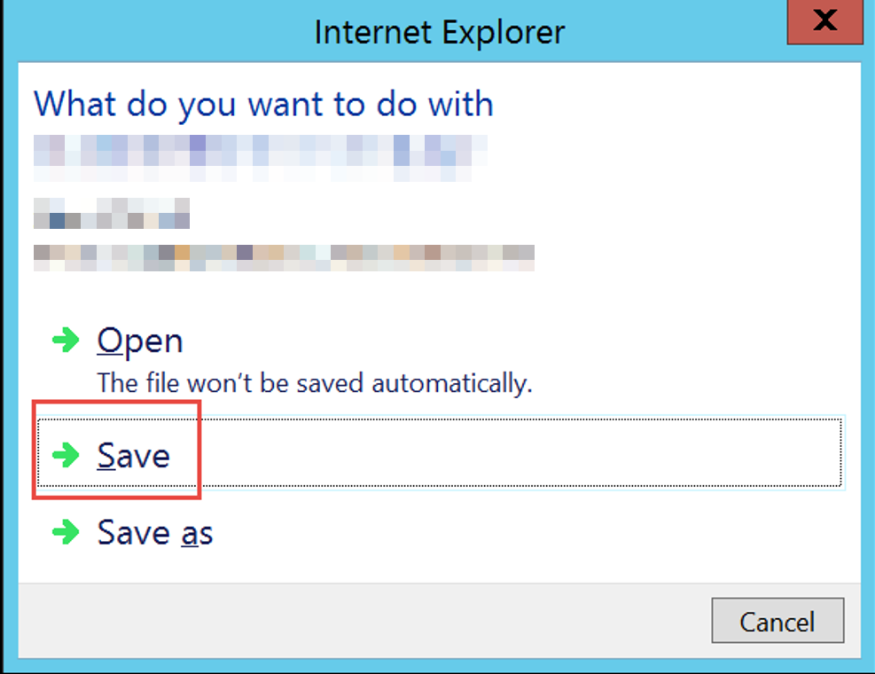

# Azure security and management

## Hands-on lab unguided

## May 2018

Information in this document, including URL and other Internet Web site references, is subject to change without notice. Unless otherwise noted, the example companies, organizations, products, domain names, e-mail addresses, logos, people, places, and events depicted herein are fictitious, and no association with any real company, organization, product, domain name, e-mail address, logo, person, place or event is intended or should be inferred. Complying with all applicable copyright laws is the responsibility of the user. Without limiting the rights under copyright, no part of this document may be reproduced, stored in or introduced into a retrieval system, or transmitted in any form or by any means (electronic, mechanical, photocopying, recording, or otherwise), or for any purpose, without the express written permission of Microsoft Corporation.

Microsoft may have patents, patent applications, trademarks, copyrights, or other intellectual property rights covering subject matter in this document. Except as expressly provided in any written license agreement from Microsoft, the furnishing of this document does not give you any license to these patents, trademarks, copyrights, or other intellectual property.

The names of manufacturers, products, or URLs are provided for informational purposes only and Microsoft makes no representations and warranties, either expressed, implied, or statutory, regarding these manufacturers or the use of the products with any Microsoft technologies. The inclusion of a manufacturer or product does not imply endorsement of Microsoft of the manufacturer or product. Links may be provided to third party sites. Such sites are not under the control of Microsoft and Microsoft is not responsible for the contents of any linked site or any link contained in a linked site, or any changes or updates to such sites. Microsoft is not responsible for webcasting or any other form of transmission received from any linked site. Microsoft is providing these links to you only as a convenience, and the inclusion of any link does not imply endorsement of Microsoft of the site or the products contained therein.

2018 Microsoft Corporation. All rights reserved.

Microsoft and the trademarks listed at <https://www.microsoft.com/en-us/legal/intellectualproperty/Trademarks/Usage/General.aspx> are trademarks of the Microsoft group of companies. All other trademarks are property of their respective owners.

# Contents

[Azure security and management hands-on lab unguided](#azure-security-and-management-hands-on-lab-unguided)

[Abstract and learning objectives](#abstract-and-learning-objectives)

[Overview](#overview)

[Solution architecture](#solution-architecture)

[Requirements](#requirements)

[Before the hands-on lab](#before-the-hands-on-lab)

[Overview](#overview-1)

[Task 1: Build a Lab Virtual Machine in Azure.](#task-1-build-a-lab-virtual-machine-in-azure.)

[Task 2: Connect to LABVM & download and unzip student files](#_Toc513553236)

[Task 3: Create a new Azure portal dashboard](#task-3-create-a-new-azure-portal-dashboard)

[Summary](#summary)

[Exercise 1: Configure Azure automation](#exercise-1-configure-azure-automation)

[Overview](#overview-2)

[Task 1: Create automation account](#task-1-create-automation-account)

[Exit criteria](#exit-criteria)

[Task 2: Add an Azure Automation Credential](#task-2-add-an-azure-automation-credential)

[Exit Criteria](#exit-criteria-1)

[Task 3: Upload DSC configurations into automation account](#task-3-upload-dsc-configurations-into-automation-account)

[Exit criteria](#exit-criteria-2)

[Exercise 2: Build CloudShop environment](#exercise-2-build-cloudshop-environment)

[Overview](#overview-3)

[Task 1: Template deployment](#task-1-template-deployment)

[Exit criteria](#exit-criteria-3)

[Task 2: Allow remote desktop to the WEBVM1 & WEBVM2 using NAT rules](#task-2-allow-remote-desktop-to-the-webvm1-webvm2-using-nat-rules)

[Exit criteria](#exit-criteria-4)

[Task 3: Configure diagnostics accounts for the VMs](#task-3-configure-diagnostics-accounts-for-the-vms)

[Exit criteria](#exit-criteria-5)

[Exercise 3: Build and configure the Azure Security Center and Azure Management](#exercise-3-build-and-configure-the-azure-security-center-and-azure-management)

[Overview](#overview-4)

[Task 1: Provision Log Analytics through Azure Monitor](#task-1-provision-log-analytics-through-azure-monitor)

[Exit criteria](#exit-criteria-6)

[Task 2: Explore Security Center](#task-2-explore-security-center)

[Exit Criteria](#exit-criteria-7)

[Task 3: Add Service Map](#task-3-add-service-map)

[Exit Criteria](#exit-criteria-8)

[Task 4: Configure Service Map](#task-4-configure-service-map)

[Exit criteria](#exit-criteria-9)

[Task 5: Configure Update Management](#task-5-configure-update-management)

[Exit Criteria](#exit-criteria-10)

[Task 6: Configure Inventory Tracking and Change Management](#task-6-configure-inventory-tracking-and-change-management)

[Exit Criteria](#exit-criteria-11)

[Exercise 4: Instrument CloudShop using Azure Application Insights](#exercise-4-instrument-cloudshop-using-azure-application-insights)

[Overview](#overview-5)

[Task 1: Install and configure the Application Insights status monitor](#task-1-install-and-configure-the-application-insights-status-monitor)

[Exit criteria](#exit-criteria-12)

[Task 2: Configure the Applications Insights workspace in Azure](#task-2-configure-the-applications-insights-workspace-in-azure)

[Exit criteria](#exit-criteria-13)

[Task 3: Simulate a failure of the CloudShop application](#task-3-simulate-a-failure-of-the-cloudshop-application)

[Exit criteria](#exit-criteria-14)

[Exercise 5: Explore Azure Security and Operations Management, Application Insights and build a dashboard](#exercise-5-explore-azure-security-and-operations-management-application-insights-and-build-a-dashboard)

[Overview](#overview-6)

[Task 1: Work with Log Analytics Data and Azure Monitor](#task-1-work-with-log-analytics-data-and-azure-monitor)

[Exit criteria](#exit-criteria-15)

[Task 2: Prevention](#task-2-prevention)

[Exit criteria](#exit-criteria-16)

[Task 3: Set up a manual activity log alert](#task-3-set-up-a-manual-activity-log-alert)

[Exit criteria](#exit-criteria-17)

[Task 4: Installing & using the Azure mobile application](#task-4-installing-using-the-azure-mobile-application)

[Exit criteria](#exit-criteria-18)

[Task 5: Application Insights](#task-5-application-insights)

[Exit criteria](#exit-criteria-19)

[After the hands-on lab](#after-the-hands-on-lab)

[Overview](#overview-7)

# Azure security and management hands-on lab unguided 

## Abstract and learning objectives 

The student will deploy and monitor a web application that has been deployed to Azure IaaS in this Hands-on Lab (HOL). The Operations Management Suite will be used to manage and monitor the operation performance and security of the underlying infrastructure. Azure Application Insights will be used to monitor performance, application usage and identify the cause of any application issues that emerge.

## Overview

FusionTomo (FT) is a multi-national holding company headquartered in Los Angeles, CA that owns 48 manufacturing companies located in North America, Europe and Asia. These companies sell their products primarily to either distributors or large retail organizations around the world. FT, as the parent company, controls the IT systems for the companies that it owns and thus runs their e-commerce based applications. There are about 125 of these e-commerce applications used primarily for business-to-business purchasing by corporate buyers. These apps provide the bulk of FT's 15 billion dollars in revenue per year, so they are mission critical.

Recently FT has started to investigate what it would take to move from on-premises datacenters to the cloud. Most of their applications are ASP.NET running on Windows VMs with SQL Server in a traditional N-tier configuration. Their goal is to lift and shift these applications over to the cloud while gaining more control over the applications and improving their security posture.

They are looking for you to build out a prototype system in Azure using a sample web application they have provided to you called CloudShop.

They are looking for management tools that will allow them to have a full end-to-end view of both the infrastructure and application performance. Their goal will be to effectively lift and shift all applications over to the cloud. They do not have time or money to instrument the applications. Of course, security is on the top of the chain, so they also need a security solution and updated management system.

Per Roberto Milian, VP of Development and IT Operations, "FT's primary concern is how to best: deploy, test, manage, monitor, patch, secure and troubleshoot these applications in Azure IaaS."

## Solution architecture

## Requirements

-   A corporate e-mail address (e.g., your \@microsoft.com email)

-   Microsoft Azure subscription must be pay-as-you-go or MSDN

    -   Trial subscriptions will *not* work

-   Local machine or an Azure LABVM virtual machine configured with:

    -   Visual Studio 2017 Community Edition or later

    -   Azure SDK 2.9. + or Later for Visual Studio

    -   Azure PowerShell 4.0 or later

## Before the hands-on lab

Duration: 30 mins

#### Overview

Before attending the HOL, you should follow these steps to prepare your environment for an efficient day. Your first task will be to build a **LABVM** to use for the HOL and download some student files that will be used. Then, you will create a new Azure Dashboard to use during the HOL.

#### Task 1: Build a Lab Virtual Machine in Azure.

1.  Launch a browser and navigate to <https://portal.azure.com>. Once prompted, login with your Microsoft Azure credentials. If prompted, choose whether your account is an organization account or just a Microsoft Account.

Note: You may need to launch an \"in-private\" session in your browser if you have multiple Microsoft Accounts.

2.  Click on **+Create a resource**, and in the search box, type in **Visual Studio Community 2017,** and press enter. Click the Visual Studio Community 2017 image running on Windows Server 2016.

    

3.  Leave the default of *Resource Manager* deployment model and click **Create**.

    

4.  Set the following configuration on the Basics tab, and click **OK**.

    -   Name: **LABVM**

    -   VM disk type: **SSD**

    -   User name: **demouser**

    -   Password: **demo\@pass123**

    -   Subscription: **If you have multiple subscriptions, choose the subscription to execute your labs in.**

    -   Resource Group: **OPSLABRG**

    -   Location: **Choose the closest Azure region to you.**

    

5.  Choose the **DS2\_V2 or D2S\_V3 Standard** instance size on the Size blade.

    
6.  Accept the default values on the Settings blade, and click **OK**. On the Summary page, click **OK**. The deployment should begin provisioning. It may take 10+ minutes for the virtual machine to complete provisioning.

    

7.  Once the deployment is complete, move on to the next exercise.

#### Task 2: Connect to LABVM & download and unzip student files

1.  Move back to the Portal page on your local machine, and wait for **LABVM** to show the Status of **Running**. Once it is running, click **Connect** to establish a new Remote Desktop Session.

    

2.  Depending on your remote desktop protocol client and browser configuration, you will either be prompted to open an RDP file, or you will need to download it and then open it separately to connect.

3.  Login with the credentials specified during creation:

    a.  User: **demouser**

    b.  Password: **demo\@pass123**

4.  You will be presented with a Remote Desktop Connection warning because of a certificate trust issue. Click **Yes** to continue with the connection.

    

5.  When logging on for the first time, you will see a prompt on the right asking about network discovery. Click **No**.

    

6.  Open Server Manager (**Start Server Manager).** On the left, click **Local Server**.

    

    > NOTE: Server Manager may open by default.

7.  On the right side of the pane, click **On** by **IE Enhanced Security Configuration**.

    

8.  Change to **Off** for Administrators, and click **OK**.

    

9.  In the lower left corner, click on the **Windows** button to open the **Start Screen**. Then, click **Internet Explorer** to open it. On first use, you will be prompted about security settings. Accept the defaults by clicking **OK**.

    

10. If prompted, choose to Turn Protected mode on.

    

11. In the URL address window enter the below URL and hit the Enter key. This will download the class files (in a .zip format) needed for the remaining labs. <https://cloudworkshop.blob.core.windows.net/operations-management-suite/StudentFiles.zip>

    > NOTE: In some Azure VM images, the image is configured so that downloads are disabled. To enable the download of the Student Files, go to Internet Options, select the Security Tab, and on the Internet Zone select \"Custom Level\". Then scroll down to the Downloads section and select the radio button for Enable in the File Download subsection.

12. You will be prompted about what you want to do with the file. Select **Save**.

    

13. Download progress is shown at the bottom of the browser window. When the download is complete, click **Open folder**.

14. The **Downloads** folder opens. ***Right-click*** the zip file, and click **Extract All**. In the **Extract Compressed (Zipped) Folders** window, enter **C:\\HOL** in the **Select a Destination and Extract Files** dialog. Click the **Extract** button.

#### Task 3: Create a new Azure portal dashboard

1.  Open Internet Explorer on LABVM and point to <https://portal.azure.com>

2.  Sign in to Azure using your credentials.

    

3.  Once you are at the Azure portal dashboard, click **New Dashboard,** and type the name **My Dashboard**, then click **done customizing.**

    

    

4.  Then navigate back to your **LABVM** blade and use the "Pin" to add it to your new **My Dashboard**. This Dashboard will be used for the rest of this HOL.

    

5.  If you're going to be finishing this lab today, then continue to the next exercise. Otherwise, if you won't be finishing the rest of the lab today, then it may be helpful to click **Stop** on your **LABVM** within the Azure Portal. This will put the VM into a Stopped / Deallocated state, and save money until it's needed again. When you're ready to continue with the lab, then navigate back to the **LABVM** blade and click **Start** to start it back up again.

#### Summary

In this exercise, you built a LABVM to use for the HOL and downloaded some student files that will be used. Then, you created a new Azure Dashboard to use during the HOL.

**Note: You should follow all steps provided before attending the HOL.**

## Exercise 1: Configure Azure automation

Duration: 15 minutes

#### Overview

In this exercise, you will create and configure an Azure Automation account in the Azure Portal which will be used to configure the application servers using Azure DSC.

#### Task 1: Create automation account

-   Create an Azure Automation account in a new Resource group called **HOLRG**.

#### Exit criteria

-   There is now an Azure Automation account.

#### Task 2: Add an Azure Automation Credential

-   Create an Automation Credential with the following properties:

    a.  Name: **SQLLocalAdmin**

    b.  User Name: **demouser**

    c.  Password & Confirm: **demo\@pass123**

NOTE: It is important to use the exact name for the credential, because one of the scripts you upload in the next step references the name directly.

#### Exit Criteria

-   There is now an Automation Credential.

#### Task 3: Upload DSC configurations into automation account

-   Create two DSC Configurations using the provided files: **C:\\HOL\\CloudShopWeb.ps1** & **C:\\HOL\\CloudShopSQL.ps1**. Make sure they are ready to configure the VMs that will be used for the pilot.

#### Exit criteria

-   The DSC nodes have been configured. Now, use the two PowerShell scripts provided in the Student files.

## Exercise 2: Build CloudShop environment

Duration: 60 minutes

#### Overview

In this exercise, you will run a template deployment using an ARM template provided which will deploy a Virtual Network, Azure Load balancer, two IIS Servers and a SQL Server. The Servers will check into Azure Automation and run the DSC Configurations that you built in Exercise 1. This will configure the boxes with the CloudShop Application. You will also configure Inbound NAT Rules to allow RDP access to the Web Servers. Azure diagnostics will also be configured into a new storage account for the VMs.

#### Task 1: Template deployment

1.  Locate the Access Keys and URL for your Azure Automation account.

2.  Using the Azure Portal perform a Template Deployment using the **C:\\HOL\\OMSHOL-azuredeploy.json** file and the **C:\\HOL\\parameters.txt** to complete the required inputs.

3.  Verify the deployment worked correctly by viewing the CloudShop website by pointing a web browser at the Azure Load balancer. Make sure you can see two VMs answering your http calls.

#### Exit criteria

-   CloudShop Website is up and running and answering on the Load balancer. Verify that both **WEBVM1** and **WEBVM2** are serving pages.

#### Task 2: Allow remote desktop to the WEBVM1 & WEBVM2 using NAT rules

1.  Configure the Azure Load Balancer to allow RDP access to both **WEBVM1** and **WEBVM2**.

2.  RDP to each of the servers, and disable the IE Enhanced Security Configuration.

#### Exit criteria

-   It is possible to RDP to **WEBVM1** and **WEBVM2** through the Azure Load Balancer.

-   All the Servers can now use the IE Web Browsers normally.

#### Task 3: Configure diagnostics accounts for the VMs

1.  For each **VM** in the **HOLRG,** configure Client Diagnostics. Make sure to capture the correct type of Metrics based on the type of Server.

#### Exit criteria

-   The Diagnostics were setup for each VM.

## Exercise 3: Build and configure the Azure Security Center and Azure Management

Duration: 30 minutes

#### Overview

The next step is to provision the Azure security and Azure management components of Azure Automation, configure the VMs for the CloudShop application to be managed by the portal, and configure the diagnostics storage account to load data into the Log Analytics platform. Additionally, you will configure Update Management, Inventory Tracking and Change Management as well as install and configure the Service Map solution pack.

#### Task 1: Provision Log Analytics through Azure Monitor

1.  Use Azure Monitor to create a Log Analytics workspace to make sure to use the OMS pricing tier.

2.  Connect the Virtual machines from the **HOLRG**.

#### Exit criteria

-   The Log Analytics portal was created.

-   The VMs that make of the CloudShop Application are connected to the workspace.

#### Task 2: Explore Security Center

1.  Open the Azure portal and navigate to the **Security Center** menu option.

2.  Upgrade to Standard tier to get advanced security.

#### Exit Criteria

-   Azure Security Center has been upgraded to the Standard tier.

#### Task 3: Add Service Map

-   Add the following Solution packs using the Azure Portal: **Service Map**

#### Exit Criteria

-   The following Solution packs have been added using the Azure Portal: **Service Map**

#### Task 4: Configure Service Map

-   Open a Remote Desktop Connection to **WEBVM1.**

-   Open a web browser to download and run the Microsoft Dependency Agent installer from <https://aka.ms/dependencyagentwindows>

-   Perform these same steps on **WEBVM2.**

-   Navigate to All resources menu item in the Azure Portal and locate the Service Map created earlier.

-   Drill down to the **WEBVM1** to see how Service Map monitors the services in the virtual machine.

#### Exit criteria

-   The Microsoft Dependency Agent has been installed on **WEBVM1** and **WEBVM2.**

#### Task 5: Configure Update Management

-   Enable **Update management** for the following VMs: **WEBVM1**, **WEBVM2**, and **SQLVM**

#### Exit Criteria

-   **Update management** has been enabled on the following VMs: **WEBVM1**, **WEBVM2**, and **SQLVM**

#### Task 6: Configure Inventory Tracking and Change Management

-   Enable **Change Tracking and Inventory** for the following VMs: **WEBVM1**, **WEBVM2**, and **SQLVM**

#### Exit Criteria

-   **Change Tracking and Inventory** has been enabled on the following VMs: **WEBVM1**, **WEBVM2**, and **SQLVM**

## Exercise 4: Instrument CloudShop using Azure Application Insights

Duration: 45 minutes

#### Overview

In this exercise, you will instrument the CloudShop using Application Insights at runtime. This will be accomplished by installing the Applications Insights tool on web services and configuring an Application Insight workspace in Azure. Then, you will configure Application Insights to perform web tests and alerts. The final task will be to connect the Application Insights workspace to send data to the Portal.

#### Task 1: Install and configure the Application Insights status monitor

1.  Connect to the **WEBVM1** and install the Application Insights Monitor using this Link: <http://bit.ly/2jxQ43z>

2.  Configure Applications Insights Monitor to Send Telemetry to a New Application Insights resource that will be in a new resource group named the **HOLInsights**.

3.  Make sure to **Add Application Insights** to the default application and Restart IIS. Make sure that data is flowing to Azure.

4.  Complete the same steps as above on **WEBVM2**, but pointing the Telemetry to the Application Insights created on **WEBVM1**.

#### Exit criteria

-   Application Insights Monitor was installed and configured on **WEBVM1** & **WEBVM2**.

-   The CloudShop Application on both servers is sending live telemetry data to the newly created Application Insights workspace in Azure.

#### Task 2: Configure the Applications Insights workspace in Azure

1.  In the Azure portal ensure that you see two servers sending live stream data and that App Map shows the application and dependency of the SQL Server.

2.  Configure an alert called **CloudShopProcessorAlert.** This will capture **Processor Time**, **Greater than 80%,** **Over the Last 5 Minutes** and have it Email the Owners.

3.  Next, add a **Web Test** named **CloudShopWebTest** using a **URL Ping Test** against your site with locations from all over the world.

4.  Now, add a new Performance Test using Application Insights named **CloudShopLoadTest** with 2000 users for a duration of 5 minutes from a Region of your choice. **Run the Test**.

5.  As the test is running use the **Live Stream** and the **Load Test Blade** to observe the Test and the performance of the CloudShop Application.

#### Exit criteria

-   The Servers were found to be providing Live Stream Data to the Azure Applications Insights portal.

-   An alert email was received based on the simulated failure of the CloudShop website.

-   An alert was created to send an email to the owner of the subscription if the Processor was over 80% utilization for 5 minutes. Because of the Load Test, the alert was triggered, and an email was received by the HOL participant. One minute after the Load Test was complete, the alert will be resolved, and another email will be received.

-   A Load test of the CloudShop application was completed, and data was collected on the performance of the web application.

-   The participant used the Live Stream to observe how the application performed under load.

#### Task 3: Simulate a failure of the CloudShop application

1.  Simulate an outage of the Cloud Shop Application by stopping your two web servers, and see how the alerts capture and warn you as the administrator of the outage.

2.  Start the web servers to resolve the simulated outage, and resolve the alerts.

#### Exit criteria

-   Alerts were received of the outage.

-   The alerts are resolved due to the website being back online.

## Exercise 5: Explore Azure Security and Operations Management, Application Insights and build a dashboard

Duration: 45 minutes

#### Overview

In this exercise, you will explore the information and data being provided by OMS and Application Insights to gain situational awareness of the application and infrastructure. You will look at the Security Posture of the infrastructure, the applications performance, and build a dashboard that can be used to manage it moving forward.

#### Task 1: Work with Log Analytics Data and Azure Monitor

1.  From your Log Analytics Blade pin your Log Search to the My Dashboard you create in the Azure Portal.

2.  Using the Log Analytics Search, export a filtered report based on the Security Baseline Data. You will want the filter to be Failed in ANALYZERESULT, and only have those errors which warning or Warning and Critical both in RULESSVERTTY. Make sure the Critical show up at the top of the report.

3.  Save your Search provided the data in the above report in Azure.

#### Exit criteria

-   The Log Search box should be pinned to the My Dashboard in the Azure Portal.

-   A report should be exported to Excel with all the Warnings and Critical Errors found using the Security Baseline analyzer runs that OMS has completed.

-   The search should be saved in the portal.

#### Task 2: Prevention

1.  Use Azure Security Center to under what preventative steps can be taken to protect your environment.

2.  Note the actions and recommendations that Security Center provides.

#### Exit criteria

-   You understand some of the baseline recommendations that Security Center provides across the Compute, Network, Storage & data, and Applications data planes.

#### Task 3: Set up a manual activity log alert

1.  Using the portal, create an alert through Azure Monitor that will send an Azure app notification when a virtual machine is restarted in the HOLRG resource group.

#### Exit criteria

-   The alert has been successfully created.

#### Task 4: Installing & using the Azure mobile application

1.  Using your mobile phone's AppStore, install the Microsoft Azure app on your smartphone, allow notifications and sign-in to Azure.

2.  In the Azure portal, navigate to **WEBVM1** virtual machine panel and restart the virtual machine.

3.  Find the alerts that have been sent to your phone. Drill into one of those alerts to see the data.

#### Exit criteria

-   The Azure mobile ap is installed on your smartphone.

-   You have looked through the notifications available and filtered the data on your phone.

-   The alert you created has fired off and caused you to get smartphone notifications, based on restarting one of the web server virtual machines.

#### Task 5: Application Insights

1.  Open the Application Insights portal Azure Monitor and use the Performance item under the Investigate section to review performance related metrics for the web applications**.**

2.  Drill into this dashboard and review the information. Filter the data to see more detailed information.

3.  Pin this dashboard to your My Dashboard.

4.  Close the Blades, and on your My Dashboard, take a few minutes to rearrange, and build a nice looking and informative dashboard for your prototype.

#### Exit criteria

-   The Application Insights performance data was reviewed and filtered to show data for the last 24 hours.

-   The Application now has a dashboard with data about the infrastructure, and the application makes up the CloudShop. The customer now has a fully implemented system to manage and monitor their application in Azure IaaS.

## After the hands-on lab 

Duration: 10 mins

#### Overview

In this exercise, attendees will de-provision any Azure resources that were created in support of the lab.

1.  Delete the **HOLRG**, **HOLInsights**, and **OPSLABRG** resource groups.

