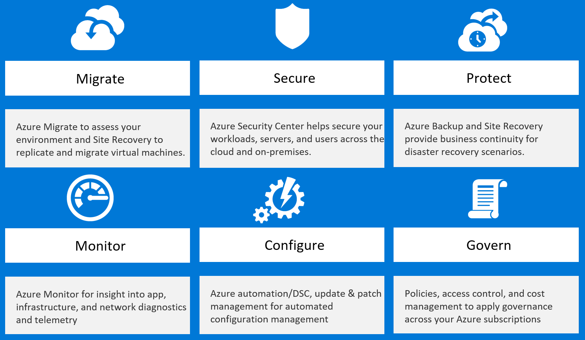

Azure security and management

Whiteboard design session student guide

June 2018

Information in this document, including URL and other Internet Web site references, is subject to change without notice. Unless otherwise noted, the example companies, organizations, products, domain names, e-mail addresses, logos, people, places, and events depicted herein are fictitious, and no association with any real company, organization, product, domain name, e-mail address, logo, person, place or event is intended or should be inferred. Complying with all applicable copyright laws is the responsibility of the user. Without limiting the rights under copyright, no part of this document may be reproduced, stored in or introduced into a retrieval system, or transmitted in any form or by any means (electronic, mechanical, photocopying, recording, or otherwise), or for any purpose, without the express written permission of Microsoft Corporation.

Microsoft may have patents, patent applications, trademarks, copyrights, or other intellectual property rights covering subject matter in this document. Except as expressly provided in any written license agreement from Microsoft, the furnishing of this document does not give you any license to these patents, trademarks, copyrights, or other intellectual property.

The names of manufacturers, products, or URLs are provided for informational purposes only and Microsoft makes no representations and warranties, either expressed, implied, or statutory, regarding these manufacturers or the use of the products with any Microsoft technologies. The inclusion of a manufacturer or product does not imply endorsement of Microsoft of the manufacturer or product. Links may be provided to third party sites. Such sites are not under the control of Microsoft and Microsoft is not responsible for the contents of any linked site or any link contained in a linked site, or any changes or updates to such sites. Microsoft is not responsible for webcasting or any other form of transmission received from any linked site. Microsoft is providing these links to you only as a convenience, and the inclusion of any link does not imply endorsement of Microsoft of the site or the products contained therein.

©  2018 Microsoft Corporation. All rights reserved.

Microsoft and the trademarks listed at <https://www.microsoft.com/en-us/legal/intellectualproperty/Trademarks/Usage/General.aspx> are trademarks of the Microsoft group of companies. All other trademarks are property of their respective owners.

**Contents**

<!-- TOC -->

- [Azure security and management whiteboard design session student guide](#azure-security-and-management-whiteboard-design-session-student-guide)
    - [Abstract and learning objectives](#abstract-and-learning-objectives)
    - [Step 1: Review the customer case study](#step-1-review-the-customer-case-study)
        - [Customer situation](#customer-situation)
        - [Customer needs](#customer-needs)
        - [Customer objections](#customer-objections)
        - [Infographic for common scenarios](#infographic-for-common-scenarios)
    - [Step 2: Design a proof of concept solution](#step-2-design-a-proof-of-concept-solution)
    - [Step 3: Present the solution](#step-3-present-the-solution)
    - [Wrap-up](#wrap-up)
    - [Additional references](#additional-references)

<!-- /TOC -->

#  Azure security and management whiteboard design session student guide

## Abstract and learning objectives 

In this session, the customer is looking for managing and monitoring solutions for their Azure IaaS move to the cloud. The student will need to provide solutions for dealing with both the VMs and the Application.

## Step 1: Review the customer case study 

**Outcome** 

Analyze your customer’s needs.
Time frame: 15 minutes 
Directions: With all participants in the session, the facilitator/SME presents an overview of the customer case study along with technical tips. 
1.  Meet your table participants and trainer 
2.  Read all of the directions for steps 1–3 in the student guide 
3.  As a table team, review the following customer case study

#### Customer situation

Contoso Holdings  is a multi-national holding company headquartered in Los
Angeles, CA that owns 48 manufacturing companies located in North America,
Europe and Asia. These companies sell their products primarily to distributors
or large retail organizations around the world. Contoso, as the parent company,
controls the IT systems for the companies that it owns and thus runs their
e-commerce based applications. There are about 125 of these e-commerce
applications used primarily for business-to-business purchasing by corporate
buyers. These apps provide the bulk of Contoso's 15 billion dollars in revenue
per year, so they are mission critical.

Contoso's CIO Jane Fields said in their last executive briefing, "we need to
optimize our architecture and move away from our brick and mortar datacenters,
but it must be done in a way where we can retain or even improve our ability to
ensure our systems are monitored and secured."

Recently Contoso has started to investigate what it would take to move from
on-premises datacenters to the cloud. Most of their applications are ASP.NET
running on Windows VMs with SQL Server in a traditional N-tier configuration.
Their goal is a lift and shift of these applications over to the cloud while
gaining more control over the applications and improving their security posture.

Per Roberto Milian, VP of Development and IT Operations, "Contoso is following
Microsoft's 'Migrate > Secure > Protect > Monitor > Configure > Govern' framework
to plan our Azure migrations and ensure our Azure deployments meet best practices. We need help with
certain parts of this process. In particular, we need to better understand
how to secure our Azure infrastructure, and how to monitor both our infrastructure
and our applications."

Milian's team is heavily investing in DevOps and already uses PowerShell DSC with
their applications. Six of their key Architects have just recently attended an
Azure DevOps training class where they learned how to create and leverage ARM
Templates. TS wants to have all applications deployed in an "Infrastructure as
Code" model, along with being configured and maintained using Azure Automation
DSC.

Contoso is looking for management tools that will allow them to have a full
end-to-end view of both the infrastructure's status and application's
performance. They do not have time or money to instrument the applications, but
they realize that they need a deeper understanding of their applications as they
have had performance issues in the past. Contoso would also like to be able to
run ad-hoc performance tests with very limited scripting.

Latisha Downs is the Global Service Management Lead for Contoso. During
discussions with her team, she was very passionate about ensuring Service
Continuity. "Of course, there is the need to have constant 'up/down' monitoring
of the sites and these tests need to be global in nature. The tool needs to
support our ability to create customized alerts that notify the Services
Operations Center (SOC) via emails into our trouble-ticket system." Downs also
mentioned during that meeting, it was clearly important to provide their service
desk personnel with mobile access to the monitoring system. Robert noted, "I
want to give them visibility no matter where they are located, and empower them
with the current status of the system by pushing alerts to their smartphones."

Having an easily customizable dashboard integrated with the Azure Portal is very
important to Contoso, as they do not want to have multiple "panes of glass" to
manage and monitor Azure. An integrated experience will reduce the learning
curve, since they are already having to learn the Azure Portal.

Of course, security is on the top of the chain, so they also need a security
solution and update management system. Since Contoso's business leverages all
e-commerce based applications, they need to ensure that only the appropriate
level of access to the system is allowed and they need to be alerted if systems
are being attacked.

#### Customer needs 

1.  Contoso wants to continue to embrace their move toward DevOps techniques, as
    they move to Azure. They want to move to an Infrastructure as Code model for
    the deployments, and they have automated configuration management for their
    applications.

2.  Contoso needs to ensure all diagnostic data for the systems are rolled up
    together to support their ability to troubleshoot outages and identify
    correlations between issues and errors to determine root cause of problems.

3.  Contoso needs a full infrastructure monitoring and management solution
    containing the following abilities. It is important that all of the machine
    data be captured and searchable by their teams. Software Update Management
    is an area that needs to be addressed, as patches need to be distributed in
    timely manner. Contoso needs a tool to determine where they stand if an
    outbreak or issue occurs. Also, whenever there is a system outage or the
    problem question comes up "what changed", the solution should be able to
    provide that type of information to the SOC. Security is a must in the cloud
    age, so Contoso needs a great dashboard and set of solutions that can help
    them understand the current status of their deployment and capture all logs
    in case of a breach. All of this together needs to allow for the creation of
    customer alerts Contoso can build on their own. They want these alerts to be
    flexible based on real machine data, emails to the trouble-ticket system and
    notifications sent to smartphones. These notifications should be accompanied
    by a professional mobile application not just the ability to log into a
    webpage from a smartphone. Finally, the customer has a huge SQL Server
    footprint with more than 150 applications relying on the DBMS. The solution
    should proactively provide feedback about the SQL Servers to help Contoso to
    correct known errors that Microsoft should correct on all SQL Servers.

4.  Contoso is also looking for an Application Monitoring Solution that can
    provide end-to-end monitoring and visibility of their applications. It needs
    to allow the team to drill into the data and determine which pieces of the
    application are not performing well including the dependences such as the
    SQL Server and any queries that are running in the background. They also
    need to have a web monitoring solution providing up/down tests from spots
    all over the globe and the ability to tell them when the application is not
    performing as expected. Performance testing is something they have lacked
    for a long time, but they have a good understanding of the applications in
    their current deployments. Contoso needs the ability to perform simple
    performance tests that will help them benchmark and size their VMs without
    having to run a bunch of code or invest in expensive tools or consultants.
    One final aspect that is important to Contoso is the ability to create
    Application Layer Alerts which need to show up in the portal. Also, the
    Application Management Solution needs to integrate with the Management and
    Monitoring solution. This means that all of the data from Application
    Performance Management (APM) should flow into the other management system.

5.  Contoso are concerned about the potential complexity of having separate
    monitoring solutions for infrastructure and applications. They are looking
    for an integrated approach that offers consistency for log search, alerting,
    analytics and dashboarding across all of their monitoring and diagnostics data.

#### Customer objections 

1.  Contoso cannot change the code of any application as a part of this
    deployment, so all application monitoring must be done without instrumenting
    the code.

1.  They believe Microsoft does their best for securing the Azure network, but
    they are very unsure how to detect when hackers are attacking their system.
    How will Microsoft's solution ensure we have visibility into our security
    posture?

1.  SQL Server is used extensively in their application eco-system. Contoso is
    concerned about proper configuration, and they are worried SQL may not
    perform adequately on VMs in Azure. The system needs to provide feedback on
    proper configurations with the ability to drill down into how the system is
    performing, even down to the query level, showing dependences and their
    ASP.NET applications.

1.  Contoso are concerned about the administrative controls. They would like to
    ensure that only approved administrators have access to manage virtual
    machines.

1.  Contoso are also concerned about how to control Azure usage without limiting
    agility. They want to ensure controls are in place across all their
    subscriptions to prevent usage of un-approved resources.

1.  Contoso would also like to ensure all Azure VMs use best practice disk
    encryption, with key management in accordance with Contoso company policies.

#### Infographic for common scenarios

## Step 2: Design a proof of concept solution

**Outcome** 
Design a solution and prepare to present the solution to the target customer audience in a 15-minute chalk-talk format. 

Time frame: 60 minutes

**Business needs**

Directions: With all participants at your table, answer the following questions
and list the answers on a flip chart. 
1.  Who should you present this solution to? Who is your target customer
    audience? Who are the decision makers? 
2.  What customer business needs do you need to address with your solution?

**Design** Directions: With all participants at your table, respond to the
following questions on a flip chart.

*High-level architecture*

1.  Without getting into the details (the following sections will address
    particular details), diagram your initial vision for handling the top-level
    requirements for deploying, testing, managing, monitoring, patch management
    compliance, securing and troubleshooting these applications in Azure IaaS.
    You will refine this diagram as you proceed.

*Address the following customer requirements*

2.  How can you deliver a single consistent experience for log search, alerting,
    analytics and dashboarding across all of Contoso's monitoring and diagnostics data?

1.  What services and approach would you take to address the need to continually
    update their infrastructure and configuration of their applications?

1.  How would changes to the configuration be tracked?

1.  How will virtual machine diagnostics data be stored, tracked and made
    searchable? To demonstrate this capability, Contoso have asked for a
    demonstration showing how your solution can
    -   Show the percentage availability (time running) of each computer, over
        the past day
    -   Identify the most frequently run processes across all VMs
    -   Chart the number of alerts raised per day, broken out by severity

1.  What approach would you take for patch management and change tracking for
    their virtual machines?

1.  What solution would you recommend for monitoring their infrastructure and
    respond against breaches? What about their servers still on-premises?

1.  How can development, administrators and engineers be notified of alerts and
    keep tabs on their infrastructure, even when away from the office?

1.  How can Contoso keep track of the status of their SQL Servers?

1.  What approach would you take for web application monitoring and capturing
    custom telemetry? How can there be a central view of the state of the
    applications? What tools are available to test performance from remote
    geographies?

**Prepare**

Directions: With all participants at your table: 

1.  Identify any customer needs that are not addressed with the proposed solution. 
2.  Identify the benefits of your solution. 
3.  Determine how you will respond to the customer’s objections. 

Prepare a 15-minute chalk-talk style presentation to the customer. 

## Step 3: Present the solution

**Outcome**
 
Present a solution to the target customer audience in a 15-minute chalk-talk format.

Time frame: 30 minutes

**Presentation** 

Directions:
1.  Pair with another table.
2.  One table is the Microsoft team and the other table is the customer.
3.  The Microsoft team presents their proposed solution to the customer.
4.  The customer makes one of the objections from the list of objections.
5.  The Microsoft team responds to the objection.
6.  The customer team gives feedback to the Microsoft team. 
7.  Tables switch roles and repeat Steps 2–6.

##  Wrap-up 

Time frame: 15 minutes

-   Tables reconvene with the larger group to hear a SME share the preferred solution for the case study.

##  Additional references

|    |            |
|----------|:-------------:|
| **Description** | **Links** |
|Azure Management Lifecycle | <https://docs.microsoft.com/azure/monitoring/> |
|Azure update management documentation  |  <https://docs.microsoft.com/azure/automation/automation-update-management> |
|Change tracking documentation    |  <https://docs.microsoft.com/azure/automation/automation-change-tracking>     |
|Azure security and operations management Documentation   | <https://docs.microsoft.com/azure/security-center/>   |
|Azure Log Analytics documentation    | <https://docs.microsoft.com/azure/log-analytics/>  |
|Azure mobile application    |<https://itunes.apple.com/us/app/microsoft-azure/id1219013620?mt=8>    |
|Azure security center and Azure SQL protection documentation   |<https://docs.microsoft.com/azure/security-center/security-center-sql-service-recommendations>    |
|App Insights documentation    |  <https://docs.microsoft.com/azure/application-insights/app-insights-overview>  |
|Instrument web apps at runtime with Application Insights  | <https://docs.microsoft.com/azure/application-insights/app-insights-monitor-performance-live-website-now>  |
|Azure Log Analytics example queries | <https://github.com/MicrosoftDocs/LogAnalyticsExamples/blob/master/log-analytics/count-and-chart-alerts-severity-per-day.md> |
|Azure security and identity best practices | https://docs.microsoft.com/azure/security/azure-security-identity-management-best-practices |
|Azure Policy | <https://docs.microsoft.com/azure/azure-policy/azure-policy-introduction> |
|Management Groups | <https://docs.microsoft.com/azure/azure-resource-manager/management-groups-overview> |
|Azure Disk Encryption | <https://docs.microsoft.com/azure/security/azure-security-disk-encryption> |
|Network Watcher Traffic Analytics | <https://docs.microsoft.com/azure/network-watcher/traffic-analytics> |
