<div class="MCWHeader1">
Azure security and management
</div>

<div class="MCWHeader2">
Whiteboard design session trainer guide
</div>

<div class="MCWHeader3">
June 2018
</div>


Information in this document, including URL and other Internet Web site references, is subject to change without notice. Unless otherwise noted, the example companies, organizations, products, domain names, e-mail addresses, logos, people, places, and events depicted herein are fictitious, and no association with any real company, organization, product, domain name, e-mail address, logo, person, place or event is intended or should be inferred. Complying with all applicable copyright laws is the responsibility of the user. Without limiting the rights under copyright, no part of this document may be reproduced, stored in or introduced into a retrieval system, or transmitted in any form or by any means (electronic, mechanical, photocopying, recording, or otherwise), or for any purpose, without the express written permission of Microsoft Corporation.

Microsoft may have patents, patent applications, trademarks, copyrights, or other intellectual property rights covering subject matter in this document. Except as expressly provided in any written license agreement from Microsoft, the furnishing of this document does not give you any license to these patents, trademarks, copyrights, or other intellectual property.

The names of manufacturers, products, or URLs are provided for informational purposes only and Microsoft makes no representations and warranties, either expressed, implied, or statutory, regarding these manufacturers or the use of the products with any Microsoft technologies. The inclusion of a manufacturer or product does not imply endorsement of Microsoft of the manufacturer or product. Links may be provided to third party sites. Such sites are not under the control of Microsoft and Microsoft is not responsible for the contents of any linked site or any link contained in a linked site, or any changes or updates to such sites. Microsoft is not responsible for webcasting or any other form of transmission received from any linked site. Microsoft is providing these links to you only as a convenience, and the inclusion of any link does not imply endorsement of Microsoft of the site or the products contained therein.

© 2018 Microsoft Corporation. All rights reserved.

Microsoft and the trademarks listed at <https://www.microsoft.com/en-us/legal/intellectualproperty/Trademarks/Usage/General.aspx> are trademarks of the Microsoft group of companies. All other trademarks are property of their respective owners.

**Contents**

<!-- TOC -->

- [Trainer information](#trainer-information)
    - [Role of the trainer](#role-of-the-trainer)
    - [Whiteboard design session flow](#whiteboard-design-session-flow)
    - [Before the whiteboard design session: How to prepare](#before-the-whiteboard-design-session-how-to-prepare)
    - [During the whiteboard design session: Tips for an effective whiteboard design session](#during-the-whiteboard-design-session-tips-for-an-effective-whiteboard-design-session)
- [Azure security and management whiteboard design session student guide](#azure-security-and-management-whiteboard-design-session-student-guide)
    - [Abstract and learning objectives](#abstract-and-learning-objectives)
    - [Step 1: Review the customer case study](#step-1-review-the-customer-case-study)
        - [Customer situation](#customer-situation)
        - [Customer needs](#customer-needs)
        - [Customer objections](#customer-objections)
        - [Infographic for common scenarios](#infographic-for-common-scenarios)
    - [Step 2: Design a proof of concept solution](#step-2-design-a-proof-of-concept-solution)
    - [Step 3: Present the solution](#step-3-present-the-solution)
    - [Wrap-up](#wrap-up)
    - [Additional references](#additional-references)
- [Azure security and management whiteboard design session trainer guide](#azure-security-and-management-whiteboard-design-session-trainer-guide)
    - [Step 1: Review the customer case study](#step-1-review-the-customer-case-study-1)
    - [Step 2: Design a proof of concept solution](#step-2-design-a-proof-of-concept-solution-1)
    - [Step 3: Present the solution](#step-3-present-the-solution-1)
    - [Wrap-up](#wrap-up-1)
    - [Preferred target audience](#preferred-target-audience)
    - [Preferred solution](#preferred-solution)
    - [Checklist of preferred objection handling](#checklist-of-preferred-objection-handling)
    - [Customer quote (to be read back to the attendees at the end)](#customer-quote-to-be-read-back-to-the-attendees-at-the-end)

<!-- /TOC -->

# Trainer information

Thank you for taking time to support the whiteboard design sessions as a trainer!

## Role of the trainer

An amazing trainer:

-   Creates a safe environment in which learning can take place.

-   Stimulates the participant's thinking.

-   Involves the participant in the learning process.

-   Manages the learning process (on time, on topic, and adjusting to benefit participants).

-   Ensures individual participant accountability.

-   Ties it all together for the participant.

-   Provides insight and experience to the learning process.

-   Effectively leads the whiteboard design session discussion.

-   Monitors quality and appropriateness of participant deliverables.

-   Effectively leads the feedback process.

## Whiteboard design session flow 

Each whiteboard design session uses the following flow:

**Step 1: Review the customer case study (15 minutes)**

Outcome: Analyze your customer's needs

-   Customer's background, situation, needs and technical requirements

-   Current customer infrastructure and architecture

-   Potential issues, objectives and blockers

**Step 2: Design a proof of concept solution (60 minutes)**

Outcome: Prepare to present a solution for your target customer audience

-   Determine your target customer audience

-   Determine customer's business needs to address your solution

-   Design and diagram your solution

-   Prepare to present your solution

**Step 3: Present the solution (30 minutes)**

Outcome: Present solution to your customer

-   Present solution

-   Respond to customer objections

-   Receive feedback

**Wrap-up (15 minutes)**

-   Review preferred solution

## Before the whiteboard design session: How to prepare

Before conducting your first whiteboard design session:

-   Read the Student guide (including the case study) and Trainer guide

-   Become familiar with all key points and activities.

-   Plan the point you want to stress, which questions you want to drive, transitions, and be ready to answer questions.

-   Prior to the whiteboard design session, discuss the case study to pick up more ideas.

-   Make notes for later.

## During the whiteboard design session: Tips for an effective whiteboard design session

**Refer to the Trainer guide** to stay on track and observe the timings.

**Do not expect to memorize every detail** of the whiteboard design session.

When participants are doing activities, you can **look ahead to refresh your memory**.

-   **Adjust activity and whiteboard design session pace** as needed to allow time for presenting, feedback, and sharing.

-   **Add examples, points, and stories** from your own experience. Think about stories you can share that help you make your points clearly and effectively.

-   **Consider creating a "parking lot"** to record issues or questions raised that are outside the scope of the whiteboard design session or can be answered later. Decide how you will address these issues, so you can acknowledge them without being derailed by them.

***Have fun**! Encourage participants to have fun and share!*

**Involve your participants.** Talk and share your knowledge but always involve your participants, even while you are the one speaking.

**Ask questions** and get them to share to fully involve your group in the learning process.

**Ask first**, whenever possible. Before launching into a topic, learn your audience's opinions about it and experiences with it. Asking first enables you to assess their level of knowledge and experience, and leaves them more open to what you are presenting.

**Wait for responses**. If you ask a question such as, "What is your experience with (fill in the blank)?" then wait. Do not be afraid of a little silence. If you leap into the silence, your participants will feel you are not serious about involving them and will become passive. Give participants a chance to think, and if no one answers, patiently ask again. You will usually get a response.

#  Azure security and management whiteboard design session student guide

## Abstract and learning objectives 

In this session, the customer is looking for managing and monitoring solutions for their Azure IaaS move to the cloud. The student will need to provide solutions for dealing with both the VMs and the Application.

## Step 1: Review the customer case study 

**Outcome** 

Analyze your customer’s needs.
Time frame: 15 minutes 
Directions: With all participants in the session, the facilitator/SME presents an overview of the customer case study along with technical tips. 
1.  Meet your table participants and trainer 
2.  Read all of the directions for steps 1–3 in the student guide 
3.  As a table team, review the following customer case study


### Customer situation

Contoso Holdings  is a multi-national holding company headquartered in Los
Angeles, CA that owns 48 manufacturing companies located in North America,
Europe and Asia. These companies sell their products primarily to distributors
or large retail organizations around the world. Contoso, as the parent company,
controls the IT systems for the companies that it owns and thus runs their
e-commerce based applications. There are about 125 of these e-commerce
applications used primarily for business-to-business purchasing by corporate
buyers. These apps provide the bulk of Contoso's 15 billion dollars in revenue
per year, so they are mission critical.

Contoso's CIO Jane Fields said in their last executive briefing, "we need to
optimize our architecture and move away from our brick and mortar datacenters,
but it must be done in a way where we can retain or even improve our ability to
ensure our systems are monitored and secured."

Recently Contoso has started to investigate what it would take to move from
on-premises datacenters to the cloud. Most of their applications are ASP.NET
running on Windows VMs with SQL Server in a traditional N-tier configuration.
Their goal is a lift and shift of these applications over to the cloud while
gaining more control over the applications and improving their security posture.

Per Roberto Milian, VP of Development and IT Operations, "Contoso is following
Microsoft's 'Migrate > Secure > Protect > Monitor > Configure > Govern' framework
to plan our Azure migrations and ensure our Azure deployments meet best practices. We need help with
certain parts of this process. In particular, we need to better understand
how to secure our Azure infrastructure, and how to monitor both our infrastructure
and our applications."


Milian's team is heavily investing in DevOps and already uses PowerShell DSC with
their applications. Six of their key Architects have just recently attended an
Azure DevOps training class where they learned how to create and leverage ARM
Templates. TS wants to have all applications deployed in an "Infrastructure as
Code" model, along with being configured and maintained using Azure Automation
DSC.

Contoso is looking for management tools that will allow them to have a full
end-to-end view of both the infrastructure's status and application's
performance. They do not have time or money to instrument the applications, but
they realize that they need a deeper understanding of their applications as they
have had performance issues in the past. Contoso would also like to be able to
run ad-hoc performance tests with very limited scripting.

Latisha Downs is the Global Service Management Lead for Contoso. During
discussions with her team, she was very passionate about ensuring Service
Continuity. "Of course, there is the need to have constant 'up/down' monitoring
of the sites and these tests need to be global in nature. The tool needs to
support our ability to create customized alerts that notify the Services
Operations Center (SOC) via emails into our trouble-ticket system." Downs also
mentioned during that meeting, it was clearly important to provide their service
desk personnel with mobile access to the monitoring system. Robert noted, "I
want to give them visibility no matter where they are located, and empower them
with the current status of the system by pushing alerts to their smartphones."

Having an easily customizable dashboard integrated with the Azure Portal is very
important to Contoso, as they do not want to have multiple "panes of glass" to
manage and monitor Azure. An integrated experience will reduce the learning
curve, since they are already having to learn the Azure Portal.

Of course, security is on the top of the chain, so they also need a security
solution and update management system. Since Contoso's business leverages all
e-commerce based applications, they need to ensure that only the appropriate
level of access to the system is allowed and they need to be alerted if systems
are being attacked.


### Customer needs 

1.  Contoso wants to continue to embrace their move toward DevOps techniques, as
    they move to Azure. They want to move to an Infrastructure as Code model for
    the deployments, and they have automated configuration management for their
    applications.

2.  Contoso needs to ensure all diagnostic data for the systems are rolled up
    together to support their ability to troubleshoot outages and identify
    correlations between issues and errors to determine root cause of problems.

3.  Contoso needs a full infrastructure monitoring and management solution
    containing the following abilities. It is important that all of the machine
    data be captured and searchable by their teams. Software Update Management
    is an area that needs to be addressed, as patches need to be distributed in
    timely manner. Contoso needs a tool to determine where they stand if an
    outbreak or issue occurs. Also, whenever there is a system outage or the
    problem question comes up "what changed", the solution should be able to
    provide that type of information to the SOC. Security is a must in the cloud
    age, so Contoso needs a great dashboard and set of solutions that can help
    them understand the current status of their deployment and capture all logs
    in case of a breach. All of this together needs to allow for the creation of
    customer alerts Contoso can build on their own. They want these alerts to be
    flexible based on real machine data, emails to the trouble-ticket system and
    notifications sent to smartphones. These notifications should be accompanied
    by a professional mobile application not just the ability to log into a
    webpage from a smartphone. Finally, the customer has a huge SQL Server
    footprint with more than 150 applications relying on the DBMS. The solution
    should proactively provide feedback about the SQL Servers to help Contoso to
    correct known errors that Microsoft should correct on all SQL Servers.

4.  Contoso is also looking for an Application Monitoring Solution that can
    provide end-to-end monitoring and visibility of their applications. It needs
    to allow the team to drill into the data and determine which pieces of the
    application are not performing well including the dependences such as the
    SQL Server and any queries that are running in the background. They also
    need to have a web monitoring solution providing up/down tests from spots
    all over the globe and the ability to tell them when the application is not
    performing as expected. Performance testing is something they have lacked
    for a long time, but they have a good understanding of the applications in
    their current deployments. Contoso needs the ability to perform simple
    performance tests that will help them benchmark and size their VMs without
    having to run a bunch of code or invest in expensive tools or consultants.
    One final aspect that is important to Contoso is the ability to create
    Application Layer Alerts which need to show up in the portal. Also, the
    Application Management Solution needs to integrate with the Management and
    Monitoring solution. This means that all of the data from Application
    Performance Management (APM) should flow into the other management system.

5.  Contoso are concerned about the potential complexity of having separate
    monitoring solutions for infrastructure and applications. They are looking
    for an integrated approach that offers consistency for log search, alerting,
    analytics and dashboarding across all of their monitoring and diagnostics data.

### Customer objections 

1.  Contoso cannot change the code of any application as a part of this
    deployment, so all application monitoring must be done without instrumenting
    the code.

1.  They believe Microsoft does their best for securing the Azure network, but
    they are very unsure how to detect when hackers are attacking their system.
    How will Microsoft's solution ensure we have visibility into our security
    posture?

1.  SQL Server is used extensively in their application eco-system. Contoso is
    concerned about proper configuration, and they are worried SQL may not
    perform adequately on VMs in Azure. The system needs to provide feedback on
    proper configurations with the ability to drill down into how the system is
    performing, even down to the query level, showing dependences and their
    ASP.NET applications.

1.  Contoso are concerned about the administrative controls. They would like to
    ensure that only approved administrators have access to manage virtual
    machines.

1.  Contoso are also concerned about how to control Azure usage without limiting
    agility. They want to ensure governance controls are in place across all their
    subscriptions to prevent usage of un-approved resources.

1.  Contoso would also like to ensure all Azure VMs use best practice disk
    encryption, with key management in accordance with Contoso company policies.

### Infographic for common scenarios


## Step 2: Design a proof of concept solution

**Outcome** 
Design a solution and prepare to present the solution to the target customer audience in a 15-minute chalk-talk format. 

Time frame: 60 minutes

**Business needs**

Directions: With all participants at your table, answer the following questions
and list the answers on a flip chart. 
1.  Who should you present this solution to? Who is your target customer
    audience? Who are the decision makers? 
2.  What customer business needs do you need to address with your solution?

**Design** Directions: With all participants at your table, respond to the
following questions on a flip chart.


*High-level architecture*

1.  Without getting into the details (the following sections will address
    particular details), diagram your initial vision for handling the top-level
    requirements for deploying, testing, managing, monitoring, patch management
    compliance, securing and troubleshooting these applications in Azure IaaS.
    You will refine this diagram as you proceed.

*Address the following customer requirements*

2.  How can you deliver a single consistent experience for log search, alerting,
    analytics and dashboarding across all of Contoso's monitoring and diagnostics data?

1.  What services and approach would you take to address the need to continually
    update their infrastructure and configuration of their applications?

1.  How would changes to the configuration be tracked?

1.  How will virtual machine diagnostics data be stored, tracked and made
    searchable? To demonstrate this capability, Contoso have asked for a
    demonstration showing how your solution can
    -   Show the percentage availability (time running) of each computer, over
        the past day
    -   Identify the most frequently run processes across all VMs
    -   Chart the number of alerts raised per day, broken out by severity

1.  What approach would you take for patch management and change tracking for
    their virtual machines?

1.  What solution would you recommend for monitoring their infrastructure and
    respond against breaches? What about their servers still on-premises?

1.  How can development, administrators and engineers be notified of alerts and
    keep tabs on their infrastructure, even when away from the office?

1.  How can Contoso keep track of the status of their SQL Servers?

1.  What approach would you take for web application monitoring and capturing
    custom telemetry? How can there be a central view of the state of the
    applications? What tools are available to test performance from remote
    geographies?


**Prepare**

Directions: With all participants at your table: 

1.  Identify any customer needs that are not addressed with the proposed solution. 
2.  Identify the benefits of your solution. 
3.  Determine how you will respond to the customer’s objections. 

Prepare a 15-minute chalk-talk style presentation to the customer. 

## Step 3: Present the solution

**Outcome**
 
Present a solution to the target customer audience in a 15-minute chalk-talk format.

Time frame: 30 minutes

**Presentation** 

Directions:
1.  Pair with another table.
2.  One table is the Microsoft team and the other table is the customer.
3.  The Microsoft team presents their proposed solution to the customer.
4.  The customer makes one of the objections from the list of objections.
5.  The Microsoft team responds to the objection.
6.  The customer team gives feedback to the Microsoft team. 
7.  Tables switch roles and repeat Steps 2–6.


##  Wrap-up 

Time frame: 15 minutes

-   Tables reconvene with the larger group to hear a SME share the preferred solution for the case study.

##  Additional references


|    |            |
|----------|:-------------:|
| **Description** | **Links** |
|Azure Management Lifecycle | <https://docs.microsoft.com/azure/monitoring/> |
|Azure update management documentation  |  <https://docs.microsoft.com/azure/automation/automation-update-management> |
|Change tracking documentation    |  <https://docs.microsoft.com/azure/automation/automation-change-tracking>     |
|Azure security and operations management Documentation   | <https://docs.microsoft.com/azure/security-center/>   |
|Azure Log Analytics documentation    | <https://docs.microsoft.com/azure/log-analytics/>  |
|Azure mobile application    |<https://itunes.apple.com/us/app/microsoft-azure/id1219013620?mt=8>    |
|Azure security center and Azure SQL protection documentation   |<https://docs.microsoft.com/azure/security-center/security-center-sql-service-recommendations>    |
|App Insights documentation    |  <https://docs.microsoft.com/azure/application-insights/app-insights-overview>  |
|Instrument web apps at runtime with Application Insights  | <https://docs.microsoft.com/azure/application-insights/app-insights-monitor-performance-live-website-now>  |
|Azure Log Analytics example queries | <https://github.com/MicrosoftDocs/LogAnalyticsExamples/blob/master/log-analytics/count-and-chart-alerts-severity-per-day.md> |
|Azure security and identity best practices | https://docs.microsoft.com/azure/security/azure-security-identity-management-best-practices |
|Azure Policy | <https://docs.microsoft.com/azure/azure-policy/azure-policy-introduction> |
|Management Groups | <https://docs.microsoft.com/azure/azure-resource-manager/management-groups-overview> |
|Azure Disk Encryption | <https://docs.microsoft.com/azure/security/azure-security-disk-encryption> |
|Network Watcher Traffic Analytics | <https://docs.microsoft.com/azure/network-watcher/traffic-analytics> |

# Azure security and management whiteboard design session trainer guide

## Step 1: Review the customer case study

-   Check in with your table participants to introduce yourself as the trainer.

-   Ask, "What questions do you have about the customer case study?"

-   Briefly review the steps and timeframes of the whiteboard design session.

-   Ready, set, go! Let the table participants begin.

## Step 2: Design a proof of concept solution

-   Check in with your tables to ensure that they are transitioning from step to step on time.

-   Provide some feedback on their responses to the business needs and design.

    -   Try asking questions first that will lead the participants to discover the answers on their own.

-   Provide feedback for their responses to the customer's objections.

    -   Try asking questions first that will lead the participants to discover the answers on their own.

## Step 3: Present the solution

-   Determine which table will be paired with your table before Step 3 begins.

-   For the first round, assign one table as the Microsoft team and the other table as the customer.

-   Have the Microsoft team present their solution to the customer team.

    -   Have the customer team provide one objection for the Microsoft team to respond to.

    -   The presentation and objections should be no longer than 10-minutes.

-   Have participants on the customer team give feedback to the Microsoft team.

    -   The feedback should be no longer than 5 minutes.

    -   If needed, the trainer may also provide feedback.

## Wrap-up

-   Have the table participants reconvene with the larger session group to hear
    a SME share the following preferred solution.

##  Preferred target audience

Jane Fields, Chief Information Officer

Roberto Milian, VP of Development and IT Operations

Latisha Downs, Global Service Management Lead

The primary audience are the business and technology decision makers. From the
case study scenario, this would include the CIO, VP of Development and IT
Operations and the Global Service Management Lead. Working at each level for
sponsorship and buy in will be important to the success of the solution.

## Preferred solution

*High-level architecture*

-  *Without getting into the details (the following sections will address
    particular details), diagram your initial vision for handling the top-level
    requirements for deploying, testing, managing, monitoring, patch management
    compliance, securing and troubleshooting these applications in Azure IaaS.
    You will refine this diagram as you proceed.*

-   Contoso and Microsoft have worked closely along with a partner, to design a
    solution that meets the needs for migrating the e-commerce applications to
    Azure. A "Lift & Shift" approach is being proposed.

    The design consists of using **Azure Resource Manager**, along with several
    Microsoft Cloud monitoring and management products:

    -  **Azure Resource Manager** is the management interface that is used to
       deploy and manage applications. In the case of Contoso, they have moved to a
       DevOps model for the deployment and management of their Infrastructure.
       Using ARM Templates along with a Source Control solution, provides the
       ability to automate and deploy their VMs in a repeatable manner without
       human interaction. Once the template has been tested and deployed to
       Azure, it will be checked into source control. All subsequent updates to
       the systems will be made by checking the template out of source control,
       making changes, testing them thoroughly, then deploying the updated
       template via automation.
    -  **Azure Security Center**: Azure Security Center provides a unified view
       into the security posture of your hybrid cloud workloads, enabling you
       discover and assess the security of your workloads and to identify and
       mitigate risk.
    -  **Azure Monitor:** Azure Monitor provides base-level infrastructure
       metrics and logs for most services in Microsoft Azure. Azure services
       that do not yet put their data into Azure Monitor will put it there in
       the future.
    -  **Log Analytics** provides centralized log ingestion and in-depth
       analytics. A variety of 'solution packs' within Log Analytics will be
       used, for update management, change tracking and understanding
       application dependencies. Azure Security Center also uses Log Analytics
       as its underlying engine.
    -  **Application Insights:** Application Insights is an extensible APM
       service for web developers on multiple platforms. It can be used to
       monitor the Contoso live web applications. The data supplied to the Azure
       Portal is captured either at Runtime and/or by instrumenting an
       application. Each application will be fitted with the Applications
       Insight Status Monitor which is installed on the IIS servers and captures
       data at runtime and sends it to the Azure Portal. All the Applications
       Insights portals will then be connected to Log Analytics via the
       Applications Insights solution. App Insights has many capabilities that
       meet the monitoring, alerting, testing and dependency drill through that
       Contoso stated are critical for their deployment.
    -  **Azure Automation** provides a framework for deploying application
       updates and OS patches across the virtual machine infrastructure, using
       PowerShell DSC.
    -  **Azure Network Watcher** provides additional visibility into network
       configuration, traffic and performance. In particular, the Traffic
       Analytics feature of Network Watcher helps understand your network
       traffic flows, including identifying potentially malicious traffic.

    The combination of these powerful services will provide the visibility to
    Contoso's leaders, described as the "end-to-end" view of the e-commerce
    applications into Azure IaaS.

    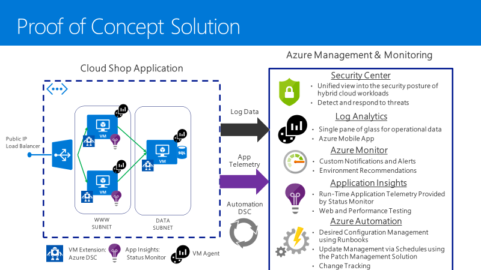

1.  How can you deliver a single consistent experience for log search, alerting, analytics and dashboarding across all of Contoso's monitoring and diagnostics data?

    - [Azure Monitor](https://docs.microsoft.com/azure/monitoring-and-diagnostics/monitoring-overview-azure-monitor "Azure Monitor overview documentation page") supports ingesting logs and metrics from multiple sources. This includes application logs, diagnostic logs, and system metrics, such as CPU load, disk capacity, and network utilization. It can also ingest the Azure Activity Log, which records all Azure administrator activity.
    
    - From this central hub, Azure Monitor supports log storage and archiving, log queries, visualization using the Azure Dashboard, and automation of follow-on tasks using Azure Automation.
    
    - In addition, logs can be passed to other services, for example to Application Insights for deeper analytics, and PowerBI for more detailed investigation and reporting. Logs can also be routed to other services, including third-party services, via Azure Event Hub.
    
    - Application Insights, Azure Monitor and Azure Log Analytics use the same query language (Kusto Query Language), making it easy for administrators to learn a single approach to querying all data sources.

    - Azure Monitor also enables alerts to be configured, again providing a single consistent hub for managing all alerts across the platform.
    
        

2.  What services and approach would you take to address the need to continually
    update their infrastructure and configuration of their applications?

    -  Deployment and control of their applications using Azure Automation DSC
       and Infrastructure as Code using ARM Templates. Both DSC and Templates
       provide a 'declarative' model in which engineers define the goal state of
       their resources, and allow the DSC or Template engine to drive their
       infrastructure towards that goal state. This is a quicker, more reliable,
       and simpler approach than provisioning using traditional scripts.
    -  Contoso will use ARM Templates that will define the infrastructure for each
       application. When the VMs are provisioning, they will communicate with
       Azure Automation and use Desired State Configuration to receive the
       application configurations. This is a fully automated install and
       configuration management solution leveraging DevOps principles.
       Deployment can be done via the Portal, Visual Studio, PowerShell or the
       Azure CLI leveraging a Source Control Platform such as GitHub.

        

3.  How would changes to the configuration be tracked?

    -  Using an Infrastructure as Code approach, all DSC configurations and
       Resource Manager Templates will be managed using a source control system
       such as GitHub.
    -  All Azure resource management operations are tracked in the Azure
       Activity Log, which is integrated with Azure Monitor and Azure Log
       Analytics. This integration enables easy and powerful searching, and
       alerting.

4.  How will virtual machine diagnostics data be stored, tracked and made
    searchable? 

    -  VM diagnostics will be enabled and configured to send logs to Log
       Analytics capturing the correct events. All this data is indexed as it is
       ingested for extremely fast searches from the Log Analytics interface.
       This can be used by the various teams at Contoso to troubleshoot and correlate
       issues between multiple machines/systems. It can also be used to create
       custom alerts (from errors and warnings in the data) to give the team a
       better understanding of what is happening to specific applications or
       VMs. The more that the team uses this capability the better they will
       become at working with machine data.

    -  To demonstrate this capability, use the following queries (based on the samples at <https://github.com/MicrosoftDocs/LogAnalyticsExamples/tree/master/log-analytics>)
       -   Show the percentage availability (time running) of each computer, over the past day ([source](https://github.com/MicrosoftDocs/LogAnalyticsExamples/blob/master/log-analytics/server-availability-rate.md "Link to query source"))
            ```
           let start_time=startofday(datetime("2018-03-01"));
           let end_time=now();
           Heartbeat
           | where TimeGenerated > start_time and TimeGenerated < end_time
           | summarize heartbeat_per_hour=count() by bin_at(TimeGenerated, 1h, start_time), Computer
           | extend available_per_hour=iff(heartbeat_per_hour>0, true, false)
           | summarize total_available_hours=countif(available_per_hour==true) by Computer 
           | extend total_number_of_buckets=round((end_time-start_time)/1h)+1
           | extend availability_rate=total_available_hours*100/total_number_of_buckets
           ```
       -   Identify the most frequently run processes across all VMs ([source](https://github.com/MicrosoftDocs/LogAnalyticsExamples/blob/master/log-analytics/top-5-running-processes-in-the-last-3-days.md "Link to query source"))
            ```
           // Find all processes that started in the last 3 days. ID 4688: A new process has been created.
           let RunProcesses = 
               SecurityEvent
               | where TimeGenerated > ago(3d)
               | where EventID == "4688";
           // Find the 5 processes that were run the most
           let Top5Processes =
               RunProcesses
               | summarize count() by Process
               | top 5 by count_;
           // Create a time chart of these 5 processes - hour by hour
           RunProcesses 
           | where Process in (Top5Processes) 
           | summarize count() by bin (TimeGenerated, 1h), Process
           | render timechart
           ```
       -   Chart the number of alerts raised per day, broken out by severity ([source](https://github.com/MicrosoftDocs/LogAnalyticsExamples/blob/master/log-analytics/count-and-chart-alerts-severity-per-day.md "Link to query source"))
            ```
           Alert 
           | where TimeGenerated > ago(7d)
           | summarize count() by AlertSeverity, bin(TimeGenerated, 1d)
           | render barchart kind=unstacked
           ```

5.  What approach would you take for patch management and change tracking for
    their virtual machines?

    -  Use the Infrastructure monitoring and management solution, which supports
       log collection, search and analytics. All VMs will be added to the Log
       Analytics platform, ensuring that log data from every Contoso system is
       centralized (one portal experience) and indexed. This will allow for the
       system to meet the needs of the all Contoso teams. Log Analytics solutions
       that are enabled will provide pre-built queries and visualizations to
       unlock immediate value from this massive amount of log data. Also,
       ad-hock queries can be performed an easy to learn query language.

        

    Patch Management Compliance

    - Ensuring that all the VMs have the correct patch levels is critically
      important. Using the Update Management automation solution allows for
      managing the updates for Windows and Linux VMs.
    - The Services Operations Center (SOC) can check the patch status of any VM
      simply by navigating to the 'Update Management' tile on the virtual machine blade.

      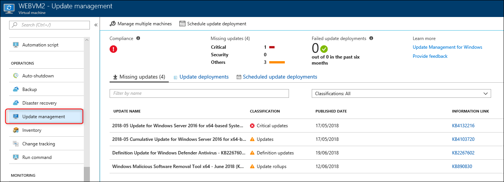

    - The Service Operation Center (SOC) can also get an all-up view of update
      status across their Azure VMs by navigating to the 'Update Management'
      tile of their Azure Automation account.

      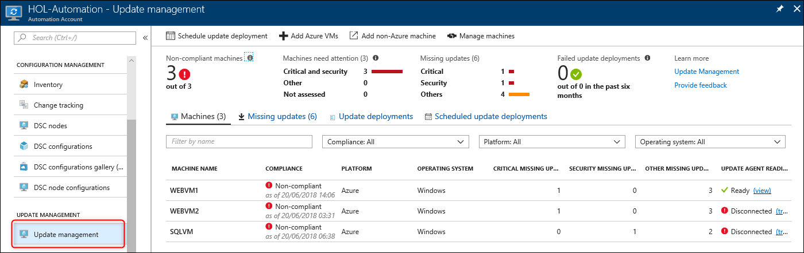

    - From either the virtual machine blade or the Azure Automation blade, there
      is also the ability to create an "Update Deployment", which will then
      schedule installation of the required updates for the VMs. You can
      configure which machines will be updated, when the update will run, which
      updates to include (based on classification), and which to exclude (based
      on KnowledgeBase IDs). You can also configure the duration of the
      maintenance window (if not all updates are completed in this time,
      remaining updates are skipped so the VMs can be brought back online). Once
      submitted, this creates an Azure Automation Runbook that will kick off the
      install of the updates. Of course, access to either a WSUS server, or
      access to Microsoft Update, is required.

        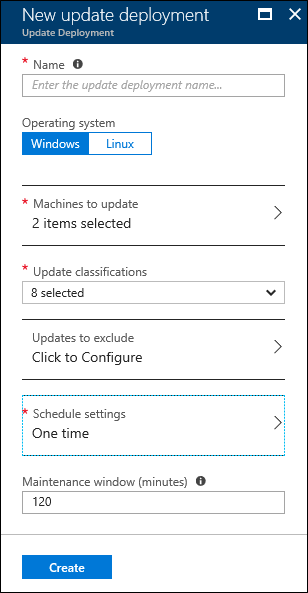
  
    Change Tracking

    - The Change Tracking Solution uses Log Analytics data to identify changes
      in the environment. The solution will track changes to Windows/Linux
      Software, Windows Files, Windows Services, and Linux daemons. This allows
      the technical team to monitor and drill into specific machines to answer
      the question of, "what changed?", which always comes up during an outage
      or troubleshooting session for a service that is having issues. The
      following changes can be viewed: changes by configuration type for
      software and services, software changes to applications and updates to
      servers, total number of changes for each application, Linux packages,
      Windows service change for individual servers and Linux daemon changes.

    

6.  What solution would you recommend for monitoring their infrastructure and
    respond against breaches? What about their servers still on-premises?

    -   Security Dashboards and Forensics

        Azure Security Center provides a unified view into the security posture
        of your hybrid cloud workloads, enabling you to discover and assess the
        security of your workloads and to identify and mitigate risk. Using
        Azure Security Center will allow Contoso:

        **Centralized policy management** -- Ensure compliance with company or
        regulatory security requirements by centrally managing security policies
        across all hybrid cloud workloads.

        **Continuous security assessment** -- Monitor the security of machines,
        networks, storage and data services, and applications to discover
        potential security issues.

        **Actionable recommendations** -- Remediate security vulnerabilities
        before they can be exploited by attackers with prioritized and
        actionable security recommendations.

        **Advanced cloud defenses** -- Reduce threads with just in time access
        to management ports and whitelisting to control applications running on
        VMs.

        **Prioritized alerts and incidents** -- Focus on the most critical
        threats first with prioritized security alerts and incidents.

        **Integrated security solutions** -- Collect, search, and analyze
        security data from a variety of sources, included connected partner
        solutions.

        

    -   Service Map
    
        Service Map automatically discovers application components on Windows
        and Linux systems and maps the communication between services. It also
        consolidates data collected by other services and solutions to assist
        you in analyzing performance and identifying issues.??

        

7.  How can development, administrators and engineers be notified of alerts and
    keep tabs on their infrastructure, even when away from the office?

    -  Custom Alerts that can trigger email notifications and push notifications
       to mobile devices such as smartphones

    -  At the heart of all solutions and monitoring in Log Analytics is the data
       that is being sent to the system by the agent running on the Servers.
       This data can be used to create alerts to inform the SOC of issues
       happening in real-time or over a period of time. This is accomplished by
       using a "Saved search" to create an "Alert." These searches can even be
       scheduled by the team to only run at certain times. Each Alert rule can
       then have different "Alert Actions", which can include such actions as
       Email notifications, Webhooks (JSON sent to an API such as Slack or
       ServiceNOW) or even to kick off a Runbook in Azure Automation to take an
       action. The Runbooks are great for known error conditions where an
       engineer knows exactly what do in a specific error condition and can
       write a script to handle the error condition discovered by the Alert.

    - Azure has a mobile application which is installable on both iPhone and
      Android. This allows administrators to be able to have access to a
      smartphone formatted tool for viewing the dashboard. There is the
      capability to view or create custom dashboards on the phone. This mobile
      application also will allow for push notifications to these smart devices,
      so that alerts will come through as true smartphone notifications.

8.  How can Contoso keep track of the status of their SQL Servers?

    - SQL Server Management capabilities

    - Contoso using SQL Server extensively, so it is a mission critical
      platform. Contoso can use the data in Log Analytics to assess the risk and
      health of their server environment.

9.  What approach would you take for web application monitoring and capturing
    custom telemetry? How can there be a central view of the state of the
    applications? What tools are available to test performance from remote
    geographies?

    - Application Insights is a full Application Performance Management (APM)
      service for web developers and administrators. It has a full suite of
      tools that will allow for the successful adoption of the platform for
      Contoso. They have stated that they cannot go back and rewire and
      instrument their code for this portion of the deployment to Azure IaaS.
      App Insights allows for using the "Status Monitor", on the IIS Servers
      which sends telemetry data to the Azure Portal. This data provides
      powerful insights into what is happening across the application including
      details into the SQL Server calls that it is making. It also allows for
      creating alerts at the application layer for conditions that would not
      normally be possible.

        

        

    - The telemetry data that is sent to Applications Insights portal can be
      viewed in many ways: Dashboards (including the Azure Portal), Application
      Map, Live Metrics Stream, Metrics Explorer for aggregated data, PowerBI
      and others.

        

    - Using the Application Insights Connector, all of this data will be
      available in Log Analytics, meaning that all of the power of Log Analytics
      can be acted upon this data, for example for log search, dashboarding, and
      alerts.

        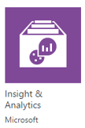

    - Up/Down Web tests from all over the world

        Ensuring availability of these e-commerce sites for Contoso is critical.
        Web Tests can be setup to monitor both the availability and the
        responsiveness of the sites. These tests can have origins from all over
        the world and will sent web request at regular intervals. Then it will
        alert the SOC if the site does not respond or is performing poorly.
        There are two types of tests: URL Ping Test and Multi-Step Web Tests.
        The SOC team can create up to 10 tests for each site.

        
        
        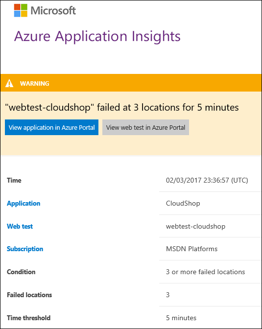

    - Performance Testing to ensure scalability

        Using the Load Testing feature of Application Insights allows the
        Engineering teams to create a true load test of the application as
        deployed in Azure. There is the ability to use either web tests that
        developers have built or the ability to do a simple Manual test by
        providing URLs to the portal. These tests can simulate the activity of
        many thousands of users. During this time, useful data will flow into
        the Applications Insights portal detailing how the application will
        perform during load. This load testing capability can also be used to
        trigger alerts that the SOC has built to ensure that they are working
        properly (expected actions from Alerts and automatic resolution once
        issues are resolved).

        

    - Custom Application Layer Alerts that can trigger email notifications

        App Insights allows the Contoso team to create performance and usage
        alerts based on metrics that are being fed to the portal for the web
        applications. There are three kinds of alerts: Metric Alerts, Web Tests
        and Proactive Diagnostics. These alerts are based on the telemetry data
        that is being provided to the portal, so can only be created based on
        what is flowing into the system. Given that the code will not be
        instrumented for these applications, Server Response ties and Server
        exceptions are the most appropriate candidates to use for alerts along
        with standard items such as average processor time.

        
        

    - Application insights also has a feature called Smart Detection. This will
      proactively look for and raise alerts based on three detection types:
      Failure Anomalies, Performance Anomalies and Azure Cloud Service Issues
      (not used in this case).

      


## Checklist of preferred objection handling

*Deal with each Objection as Stated Above:*

1.  Contoso cannot change the code of any application as a part of this
    deployment, so all applications monitoring must be done without
    instrumenting the code.

    -  Given that Azure Application insights can capture application data at
       run-time using the Status Monitor, Contoso will have rich application
       specific information that they have lacked in the past. This new
       visibility into their e-commerce implementations is a huge benefit, and a
       big win for them moving to the platform. This will also work with their
       existing applications that might remain on-premises as well.

    

2.  They believe Microsoft adequately secures the Azure platform, but they are
    unsure how to detect when hackers are attacking their deployments on the
    Azure platform. How will Microsoft's solution ensure we have visibility into
    our security posture?

    -  Security Center analyzes the security state of the compute resources,
       virtual networks, storage and data services, and applications. Continuous
       assessment helps to discover potential security issues, such as systems
       with missing security updates or exposed network ports.

    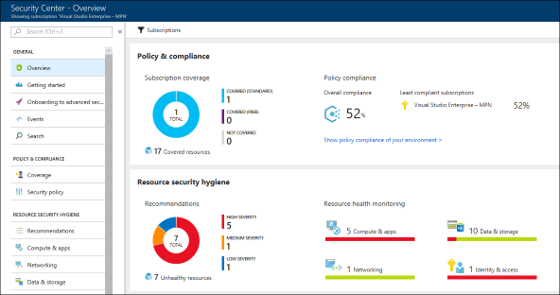

    -  Network Watcher Traffic Analytics is a cloud-based solution that provides
       visibility into user and application activity in cloud networks. Traffic
       analytics analyzes Network Watcher network security group (NSG) flow logs
       to provide insights into traffic flow in your Azure cloud. With traffic
       analytics, you can:
       - Visualize network activity across your Azure subscriptions and identify
         hot spots.
       - Identify security threats to, and secure your network, with
         information such as open-ports, applications attempting internet
         access, and virtual machines (VM) connecting to rogue networks.
       - Understand traffic flow patterns across Azure regions and the internet
         to optimize your network deployment for performance and capacity.
       - Pinpoint network misconfigurations leading to failed connections in
         your network.

    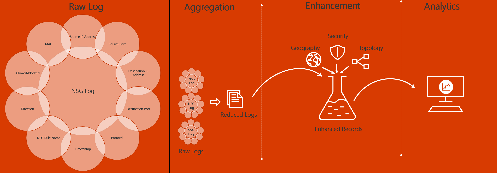

    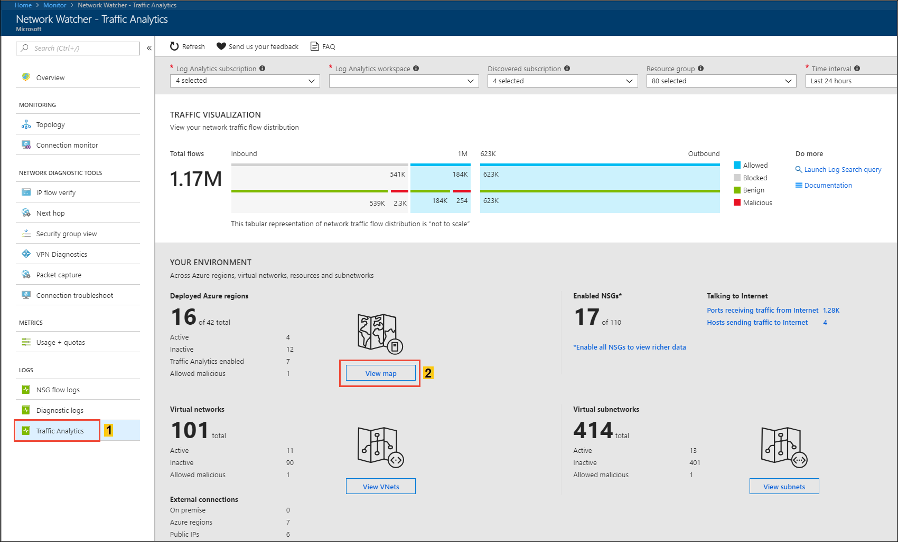


3.  SQL Server is used extensively in their application eco-system. Contoso is
    concerned about proper configuration, and they are worried SQL may not
    perform adequately on VMs in Azure. The system needs to provide feedback on
    proper configurations with the ability to drill down into how the system is
    performing, even down to the query level, showing dependences and their
    ASP.NET applications.
    
    - The SQL Server Assessment that is part of Security Center can be implemented with just a few clicks by Contoso. This assessment will run once a week and the teams can stay ahead potential issues and will have step-by-step remediation’s to know problems and misconfigurations.

        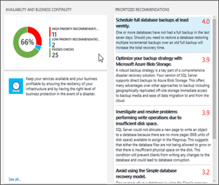

4.  Contoso are concerned about the administrative controls. They would like to
    ensure that only approved administrators have access to manage virtual
    machines.

    - Contoso can use Role-Based Access Control (RBAC) to ensure that only
      approved staff (individuals or groups) are able to manage each deployment
      RBAC permissions can be applied at the subscription, resource group, or
      individual resource level. Read-only, or read-write permissions can be
      granted. To get started Contoso can use the built-in role definitions. As
      their Azure usage becomes more advanced, they can also create custom role
      definitions tailored to their precise security needs.

      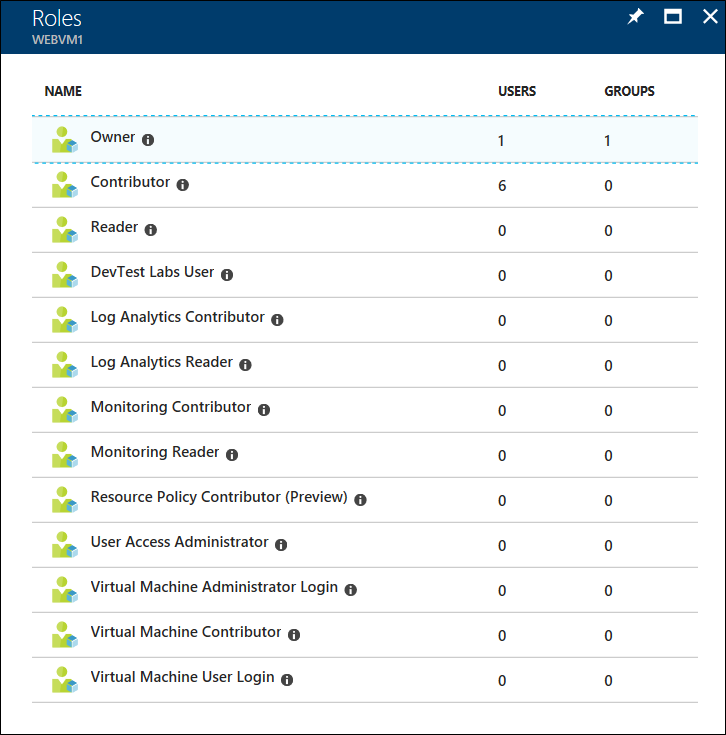

5.  Contoso are also concerned about how to control Azure usage without limiting
    agility. They want to ensure governance controls are in place across all their
    subscriptions to prevent usage of un-approved resources.

    - Contoso can use Azure Policy to control which resources can be
      provisioned. This prevents unapproved resources from being deployed
      (regardless of RBAC permissions). Note however that Azure Policy does not
      control the number of resources that may be provisioned (if a given VM SKU
      is permitted, then a user could create 1 VM or 100). Other mechanisms,
      such as Azure Automation and Azure Monitor, can be used to provide further
      control and alerting.

      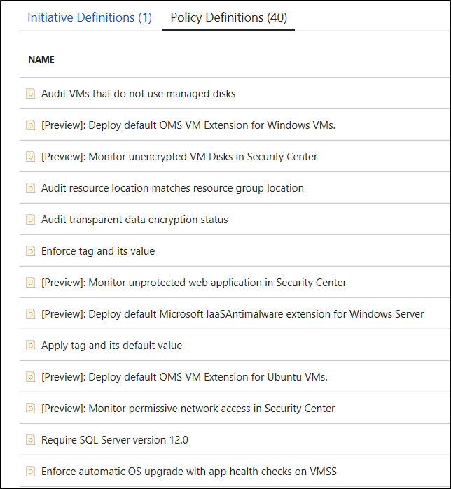

    - By deploying Azure Policy at the Tenant Root Management Group scope,
      rather than at the Azure subscription scope, the Policy will automatically
      be applied to all subscriptions within their tenant.

6.  Contoso would also like to ensure all Azure VMs use best practice disk
    encryption, with key management in accordance with Contoso company policies.

    - All Azure VM disks (both managed and unmanaged) benefit from the always-on
      Azure Storage Service Encryption, using Microsoft-managed keys.
    - In addition, Azure supports VM-level disk encryption, using Bitlocker
      (Windows) and DM-Crypt (Linux). This solution takes advantage of Azure Key Vault
      enabling the customer to control and manage the disk encryption keys.

      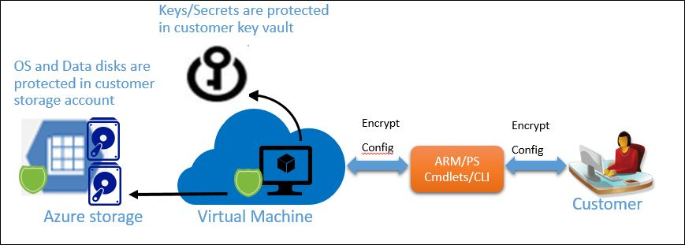

## Customer quote (to be read back to the attendees at the end)

"As we jump into Azure, I'm confident that we have the right tools to ensure that our systems will perform as needed and be secure. The best part is the visibility our teams have, end-to-end, from the Applications and SQL, down to the infrastructure."

Roberto Milian, VP of Development & IT Operations, Contoso

